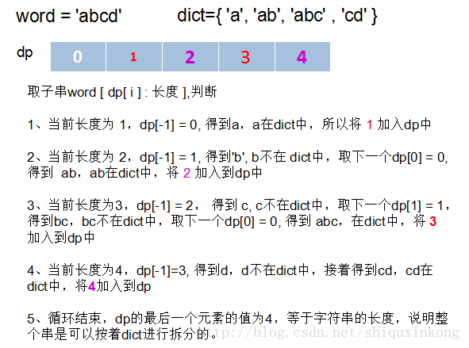

動態規劃表面上很難，其實存在很簡單的準則  
當求解的問題滿足以下兩個條件時， 就應該使用動態規劃：　　
1. 主問題的答案 包含了 可分解的子問題答案  
  （也就是說，問題可以被遞歸的思想求解）
2. 遞歸求解時， 很多子問題的答案會被多次重覆利用  
  
動態規劃的本質思想就是遞歸  
但如果直接應用遞歸方法，子問題的答案會被重覆計算產生浪費    
同時遞歸更加耗費堆疊記憶體    
所以通常用一個二維矩陣（表格）來表示不同子問題的答案  
以實現更加高效的求解。  


***

### [010.Regular_Expression_Matching](../../SourceCode/Python/010.Regular_Expression_Matching.py) Level: Hard Tags: [DP]
  
Time:  O(m * n)  
Space: O(m * n)  
  
思路:其實就是把正規表示式的"." 和 "*"寫出來    
十分難的一題  
和 [044.Wildcard_Matching](../../SourceCode/Python/044.Wildcard_Matching.py)  很像  
但兩者間有微妙的差別，具體可以見44題的思路  
不過簡單來說，這題比44題難多了  
因為本題的"*"有太多狀況要考慮了  
  
這題我們用Dynamic Programming(DP)解題  
首先我們準備一個二元的DP陣列，大小為 (s+1)*(p+1)
裏頭的元素除最左上角為True外，其餘初始值均為False    
我們用它來做DP的matching  
其中心思想是dp[sp][pp]為 s[0:sp] 和p[0:pp]是否match  
其餘的規則，我們用範例來說明，例子如下    
```
s = "xaabyc"
p = "xa*b.c"
```
以上面的例子來說，我們需要一個7*7的DP陣列 
第一行和第一列代表沒有任何字元或沒有任何pattern  
所以 "" 一定match空pattern "" 
  
|s\p|   | x | a | * | b | . | c |
|---|---|---|---|---|---|---|---|
|   | T |   |   |   |   |   |   |
| x |   |   |   |   |   |   |   |
| a |   |   |   |   |   |   |   |
| a |   |   |   |   |   |   |   |
| b |   |   |   |   |   |   |   |
| y |   |   |   |   |   |   |   |
| c |   |   |   |   |   |   |   |
    
    
在開始match traversal之前，我們先檢查一個特殊的scenario  
也就是第一行，這裡先用另一個例子說明
```s = "", p = "c*"```
在正規表示式中，"*"代表他前面的字元有可能出現多個，也有可能不出現  
所以當p[pp]為*且為第二個字元時，他必定符合空字串    
所以他的欄位應該填上True  
而我們一開始的例子裡並沒有這種情況  
所以第一行應該都填上False　　

接著我們正式開始填DP陣列  
以正規表示式來說，我們可以找到下面的規則  

1. 如果當前p的欄位是"*"的話，分成以下三種情況  
a) 考慮 "xa" match "xa*"的場合:  
p往前退一個時，"xa"一樣能match "xa"  
所以只要dp[sp][pp-1]的欄位為True，當前欄位就為True  
  
b) 考慮 "x" match "xa*" 的場合:
p往前退兩個時，"x"一樣能match "x"  
所以只要dp[sp][pp-2]的欄位為True，當前欄位就為True  
  
c) 考慮 "xaa" match "xa*" 的場合:  
只要s退一步，就能走到和上面a)一樣的 "xa" match "xa*"  
這時我們除了要確認之前match的結果 (dp[sp-1][pp])是否為True外  
還要確認s和p的前一個字元是否相同  (s[sp-1] == p[pp-2])  
或者p的前一個字元是否為'.' (p[pp-2] == '.')  
以"xaa" match "xa*"來說，他符合 s[sp-1] -> "a" == p[pp-2] -> a
所以 "xaa" match "xa*" 的欄位為 True

2. 如果當前p的欄位為"."的話，代表符合任意一個字元  
因此我們可以比較他的前一個比較結果 (dp[sp-1][pp-1]) 是否為True  
是的話當前欄位就為True  

3. 如果s的當前字元 (s[sp-1]) 等於當前p字元的話
那當然也是可以參考他的前一個結果 (dp[sp-1][pp-1])
  
情況2和3可以寫在一起以節省行數  
  
知道規則後我們從第二列開始填起  
注意*號的欄位可以參考前一個的True或前二個的True  
所以他為True

|s\p|   | x | a | * | b | . | c |
|---|---|---|---|---|---|---|---|
|   | T |   |   |   |   |   |   |
| x |   | T |   | T |   |   |   |
| a |   |   |   |   |   |   |   |
| a |   |   |   |   |   |   |   |
| b |   |   |   |   |   |   |   |
| y |   |   |   |   |   |   |   |
| c |   |   |   |   |   |   |   |
  
  
接著第三列  
比較令人注意的是 "xa" == "xa*"  

|s\p|   | x | a | * | b | . | c |
|---|---|---|---|---|---|---|---|
|   | T |   |   |   |   |   |   |
| x |   | T |   | T |   |   |   |
| a |   |   | T | T |   |   |   |
| a |   |   |   |   |   |   |   |
| b |   |   |   |   |   |   |   |
| y |   |   |   |   |   |   |   |
| c |   |   |   |   |   |   |   |


接著第四列  

|s\p|   | x | a | * | b | . | c |
|---|---|---|---|---|---|---|---|
|   | T |   |   |   |   |   |   |
| x |   | T |   | T |   |   |   |
| a |   |   | T | T |   |   |   |
| a |   |   |   | T |   |   |   |
| b |   |   |   |   |   |   |   |
| y |   |   |   |   |   |   |   |
| c |   |   |   |   |   |   |   |
  
  
全部填完後可得  

|s\p|   | x | a | * | b | . | c |
|---|---|---|---|---|---|---|---|
|   | T |   |   |   |   |   |   |
| x |   | T |   | T |   |   |   |
| a |   |   | T | T |   |   |   |
| a |   |   |   | T |   |   |   |
| b |   |   |   |   | T |   |   |
| y |   |   |   |   |   | T |   |
| c |   |   |   |   |   |   | T |

最右下角的欄位就是我們要的答案
這裡為True，所以 "xaabyc" macth "xa*b.c" 為True    


***
  
### [044.Wildcard_Matching](../../SourceCode/Python/044.Wildcard_Matching.py) Level: Hard Tags: [DP]
   
思路: 題目要求用?代表一個字元，*代表所有字元    
來比對該字串是否符合特定的pattern  
這裡有兩種解法，第一種是暴力算法，我們在這裡省略    
想看的話可以去看Hard.md  
第二種解法是動態規劃  
我們以題目給的其中一個例子來說明
```  
s = "acdcb"  
p = "a*c?b"  
```
  
首先我們宣告一個len(s)+1 x len(p)+1 的表格  
表格內的內容除了最左上角是True外，其他全為False  
如下表

|s\p|   | a | * | c | ? | b |
|---|---|---|---|---|---|---|
|   | T |   |   |   |   |   |
| a |   |   |   |   |   |   |
| c |   |   |   |   |   |   |
| d |   |   |   |   |   |   |
| c |   |   |   |   |   |   |
| b |   |   |   |   |   |   |

這是DP的表格，我們用sp和pp來iterate這個表格  
他們的初始值都是0，而dp[0][0]永遠為True  
一般情況下d[sp][pp]表示s[0:sp-1]和p[0:pp-1]是否有match    
所以我們可以不斷的參考前面的結果來得到目前的結果  

在正式填表之前，我們需要對星號做特別處理  
因為有可能p的開頭就有星號  
做法是看第一列dp[0]，如果某個元素有星號的話  
他後面的元素就會遵從這星號對應的結果  
以上表來說就是這樣  

|s\p|   | a | * | c | ? | b |
|---|---|---|---|---|---|---|
|   | T |   | F | F | F | F |
| a |   |   |   |   |   |   |
| c |   |   |   |   |   |   |
| d |   |   |   |   |   |   |
| c |   |   |   |   |   |   |
| b |   |   |   |   |   |   |

這基本上是針對第一個元素是星號程式碼  
如s = "aa", p ="*"時  
第一列都會變為True  

現在我們要正式填表了
填表格的規則如下:  

1. 如果當前p的欄位是"?"或者s[sp] match p[pp]  
那當前的欄位就可以參考前一個match的結果  
即dp[sp][pp] = dp[sp-1][pp-1]  

2. 如果當前p的欄位是"*"  
那可以直接參考他上方或他左方的結果  
其中一個是True，該欄位就能寫成True  

3. 其他情況的話保持原樣False  
  
  
我們先看sp=1的情況  
sp和pp都為1的時候，"a" match "a" 所以表格為   

|s\p|   | a | * | c | ? | b |
|---|---|---|---|---|---|---|
|   | T |   | F | F | F | F |
| a |   | T |   |   |   |   |
| c |   |   |   |   |   |   |
| d |   |   |   |   |   |   |
| c |   |   |   |   |   |   |
| b |   |   |   |   |   |   |

接著走到星號時  
"a" match "a*"所以為True
  
|s\p|   | a | * | c | ? | b |
|---|---|---|---|---|---|---|
|   | T |   | F | F | F | F |
| a |   | T | T |   |   |   |
| c |   |   |   |   |   |   |
| d |   |   |   |   |   |   |
| c |   |   |   |   |   |   |
| b |   |   |   |   |   |   |  
  
同理，第三行的元素為  

|s\p|   | a | * | c | ? | b |
|---|---|---|---|---|---|---|
|   | T |   | F | F | F | F |
| a |   | T | T |   |   |   |
| c |   |   | T | T |   |   |
| d |   |   |   |   |   |   |
| c |   |   |   |   |   |   |
| b |   |   |   |   |   |   |
  
  
中間過程省略，我們看最後一行的結果(False省略)    

|s\p|   | a | * | c | ? | b |
|---|---|---|---|---|---|---|
|   | T |   |   |   |   |   |
| a |   | T | T |   |   |   |
| c |   |   | T | T |   |   |
| d |   |   | T |   | T |   |
| c |   |   | T | T |   |   |
| b |   |   | T |   | T |   |
  
最右下角的元素便代表全部的match結果    
所以這個match的結果為False  
"acdcb" 不match "a*c?b"  
  
  
***
  
### [139.Word_Break](../../SourceCode/Python/139.Word_Break.py) Level: Medium Tags: [DP, Backtracking]
  
Time:  O(n * j), worst case is O(n^2)  
Space: O(n)    
  
思路: 給你一個用任意字母片段的List  
要你判斷用這些片段是否能湊出輸入的英文片段  
例如
```python
s = "catsandog"
wordDict = ["cats", "dog", "sand", "and", "cat"]
```
s可被字典裡的字串拼出來，所以結果為True  

第一個方法是從第一個字元開始依次向後尋找，直到找到一個可以分開的地方(斷句)，這時代表目前的substing在dictionary中    
如果找到最後都沒找到，傳回False  
  
找到第一個斷句後，接下來找下一個斷句處，就是從第一個斷句後的字元開始找連續的字串  
但此時和第一次尋找稍微不同，例如說 word = 'ab', dict= {'a', 'ab', ...}  
在從word裡找到a之後，接下來要處理的是b，我們發現b不再dict中  
但b可以和a相結合形成ab，而ab在dict中  
所以這裡的每個字串有三個選擇  

+ 自己單獨為個體到dict中尋找
+ 和前面的string合併起來一起找
+ 等後面的新字元，構成更長的substring  

以第二項來說，我們需要跟前面的string合併起來找，所以我們需要紀錄訊息來代表前面的substring  
是從哪裡分開而滿足條件的  
如此我們就能一次從離前一個substring近的部分進行結合  
例如 word = 'aab', dict= {'a', 'aab'}  
處理a時在dict中，處理下一個a也在dict中  
但再下一個b就不在dict中了  
此時就和前面的b結合形成 ab ，但發現也不在dict中  
於是繼續跟前面的substring結合形成aab，此時在dict中了  
於是word便滿足條件

第二個方法是  
在拼湊的過程中，我們會需要不斷檢查之前拼湊的結果
所以可以用Dynamic Programming解題  

首先我們先宣告一個長度比輸入字串多1的一維陣列  
除了第一個是True外，其他內容全為False，如:

|   | c | a | t | s | a | n | d | o | g |
|---|---|---|---|---|---|---|---|---|---|
| T |   |   |   |   |   |   |   |   |   |

接著我們從第一個字元c來開始掃描他們有沒有在預設的字典中  
c我們可以看到字典裡沒有這個字，所以是False
第二個字起比較複雜  
我們比較的順序會是這樣:   
ca=>a  
第三個字加入後會是:
cat=>at=>t
我們發現cat有符合字典中的字了  
所以在t的位置把False改成True  

|   | c | a | t | s | a | n | d | o | g |
|---|---|---|---|---|---|---|---|---|---|
| T |   |   | T |   |   |   |   |   |   |


第四個字母加入後會是:  
cats=>ats=>ts=>s  
和上面一樣，字典裡有cats這個字  
所以在s的位置改成True

|   | c | a | t | s | a | n | d | o | g |
|---|---|---|---|---|---|---|---|---|---|
| T |   |   | T | T |   |   |   |   |   |

第五個字母加入後是catsa  
catsa=>asta=>sta=>ta=>a  
沒什麼好說的
    
第六個字母加入後事catsan  
catsan=>astan=>tsan=>san=>an=>n  
在比到san的時候，因為san是在字典裡的字  
我們除了看san本身外，也要回頭去看扣掉san的字串比對的結果  
而扣掉san的字串是cat，之前的比對結果是True  
所以這裡我們也能填上True    

|   | c | a | t | s | a | n | d | o | g |
|---|---|---|---|---|---|---|---|---|---|
| T |   |   | T | T |   | T |   |   |   |
  
  
第七個字母加入後為 catsand，省略
第八個字母加入後為 catsando，省略
第九個字母加入後為 catsandog
catsandog=>atsandog=>tsandog=>sandog  
=>andog=>ndog=>dog=>og=>g  
在dog時，我們會去參考剩下的字串的比對結果，就是catsan
這在剛才的比對中已經證明為True了  
所以dog這裡也可以寫為True  

|   | c | a | t | s | a | n | d | o | g |
|---|---|---|---|---|---|---|---|---|---|
| T |   |   | T | T |   | T |   |   | T |

全部比完後我們看最後面的比對結果  
就是題目要的答案  
  
下圖是另一個用DP的範例  

***
  
  
### [140.Word_Break II](../SourceCode/Python/140.Word_Break_II.py) Level: Hard Tags: [DP, Sequence DP, DFS]
  
  
***
  
### [279.Perfect_Squares](../SourceCode/Python/279.Perfect_Squares.py) Level: Medium Tags: [DP]
  
  
思路:這題雖然可以用數學定理的四平方和解題  
( Lagrange's four-square theorem，每個正整數均可表示為4個整數的平方和 )  
但我們在面試中不太可能碰到剛好能用數學定理解題的情況，還是考慮一般解吧。  
此題需要使用的是Dynamic Programming  
而且屬於重疊子問題 (自上而下 ): 每個子問題只解一次，把解保存在一個需要時就可以查看的表中  
每次查表的時間為常數  
  
首先把輸入的正整數所有的完全平方數都找出來並在dp紀錄上填上1  
它是我們之後dynamic programming的依據  
接著從1開始找每個整數(x)加另一個從1開始整數的平方(y)  
例如 x+y*y  
看他們的和是否小於等於n  
是的話就能加入我們的dp筆記     
如果沒寫過的話，就能直接從dp[x]加1(這個1是找到的y給的)  
如果寫過的話，就比較目前筆記裡寫過的值+1有沒有小於目前值  
比較小的話當然採用dp[x]+1  
如此走完整個迴圈，則dp[n]即為答案
  
  
  
***
  
### [329.Longest_Increasing_Path_in_a_Matrix](../../SourceCode/Python/329.Longest_Increasing_Path_in_a_Matrix.py) Level: Hard Tags: [DFS, DP]
  
Time:  O(m * n)  
Space: O(m * n)  

思路:找出2D陣列裡所能排出最長的遞增序列  
這題非常的難，除了要會用DFS Traversal所有可能的元素外  
還要會運用Dynamic Programming  
不然就會敗在題目給的超大2D陣列下吐出Time Limit Exceeded  
  
首先我們先造出全部為0的2D陣列  
這陣列用來記錄曾經找出過的最長序列元素個數  
接著逐行逐列，用DFS找出每個元素所能形成的最長序列個數  
DFS相關的步驟可以寫成另一個函式  
這函式一開始就要先檢查dp陣列裡是否已經紀錄過找過的最長序列元素數  
找過的話就可以直接給遞回中呼叫的 sub function答案以節省時間  
沒有找過的話，我們定出四個方向的tuple  
分別代表目前元素的上下左右方  
然後依次去比較(上下左右)方的元素是否大於目前元素  
是的話深度就+1  
並且遞回呼叫DFS繼續往深處找  
該元素所能達到的最大深度找完後，把它紀錄在dp上  
就能在Leetcode給的時間限制內把所有元素所能到達的最大深度全部算完  
最後只要看dp陣列中的最大值  
就是題目要的答案了  
  
  
***
