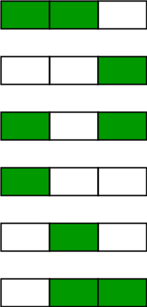
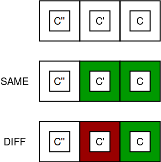
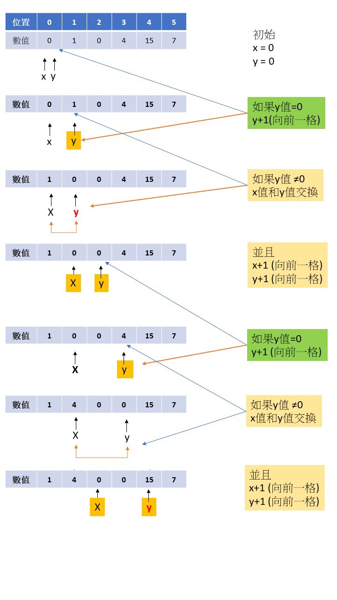

  
  
***
  
### [001.Two_Sum](../../SourceCode/Python/001.Two_Sum.py) Level: Easy Tags: []
  
Time:  O(n)  
Space: O(n)  
思路: 檢查一個List中的兩個元素相加是否等於目標的數字   
雖然看起來可用兩個for迴圈  
前一個元素和後一個元素不斷試著相加就能得出答案  
但這O(n^2)的解法在元素太多時會超出Leetcode的時間限制  
可以用另一個方式，就是既然是其中兩個元素相加會等於target  
那我們便可以得知Target減其中一個元素就等於另一個元素  
如此便可用一個暫存的dict來存放目前已經找過的元素  
另一個元素用target相減後的值能在dict中找到的話便為答案
```python
for i in xrange(len(nums)):
    if target - nums[i] in dicBuff:
        return [i, dicBuff[target - nums[i]]]
    else:
        dicBuff[nums[i]] = i
```  
  
***
  
### [014.Longest_Common_Prefix](../../SourceCode/Python/014.Longest_Common_Prefix.py) Level: Easy Tags: []
  
Time:  O(n)    
Space: O(1)   
  
思路: 要你比對給予的字串有前幾個字元是相同的  
題目不會很難，依次檢查每一個字元是否相等就可以了  
```python
ans = ""
for i in xrange(minlen):
    for s in strs:
        if s != strs[0] and s[i] != minstr[i]:
            return ans
    ans += minstr[i]
```   
  
***
  
### [121.Best_Time_to_Buy_and_Sell_Stock](../../SourceCode/Python/121.Best_Time_to_Buy_and_Sell_Stock.py) Level: Easy Tags: []
  
Time:  O(n)  
Space: O(1)    
  
思路: 給你一個整數數列當作股票的當日價格  
要你找出買進賣出利潤最大的利潤  
這是一題簡單的題目    
但一不小心還是會陰溝裡翻船  
我們從第一個元素開始令他為最小價格  
接著開始遍歷整個數列和這個最小價格比大小  
如果有比他小的值，那就把最小價格改成當前元素    
如果比最小價格大的話，就算出他們相減的利潤並和最大利潤做比較  
如果比最大利潤大的話，就把最大利潤改成這個值  
如此全部遍歷完即可得出最大利潤  
  
另外此題也是簡單的動態規劃(Dynamic Programming)題   
但簡單到不需要用DP寫了
   
  
***
  
### [122.Best_Time_to_Buy_and_Sell_Stock_II](../../SourceCode/Python/122.Best_Time_to_Buy_and_Sell_Stock_II.py) Level: Easy Tags: [Greed]
  
Time:  O(n)  
Space: O(1)
     
思路: 是上一題[121.Best_Time_to_Buy_and_Sell_Stock](../../SourceCode/Python/121.Best_Time_to_Buy_and_Sell_Stock.py) 的衍伸  
不同的是這次不限買賣次數  
要你把所有利潤都累加起來求總利潤  
直覺得會想到遍歷整個數列  
如果當前價格小於明日價格的話就是利潤所在  
但是如[1,2,3,4,5]這種數列組合    
雖然有違反題意當天買賣的嫌疑  
(第二天賣出前天股票後馬上買進，第三天又賣出並買進)  
但是這樣的計算結果卻還是對的    
其實正常的做法應該是貪婪解法:  
先找局部最小，再找局部最大的循環  
只是程式碼改進後就會變成這副模樣  
    
當然，這題也能用Dynamic Programming解題  
  
***
  
### [157.[Locked]Read_N_Characters_Given_Read4](../../SourceCode/Python/157.[Locked]Read_N_Characters_Given_Read4.py) Level: Easy Tags: []
  
  
首先要明白題意的Read4是什麼意思  
實際上你給 Read4(buf) 的buf 必須要是一個有4個空字元的list  
如:  
```python
temp = [''] * 4  # 即為['', '', '', '']
```
接著輸入的buf也是一堆空字元組成的list  
我們要做的就是利用每一次的Read4 把讀到的4個字元放到buf中  
注意每次Read4只能讀取4個字元，如果發現讀不出來了就要break  
  
  
***
  
### [257.Binary_Tree_Paths](../../SourceCode/Python/257.Binary_Tree_Paths.py) Level: Easy Tags: [Tree]
  
Time:  O(n * h)，h為樹高  
Space: O(h)  
思路: 要求你印出Binary Tree從root到所有leave的路徑   
Traversal的部分用DFS就可以做到  
問題在於怎麼把每次的路徑都印出來  
我們可以在DFS裡面加上純leave的判斷  
traversal到leave即印出其中一條路徑  
在traversal到leave後我們需要把leave Node pop出來  
不然就會變成一般的DFS traversal了  
  
   
***
  
### [263.Ugly_Number](../../SourceCode/Python/263.Ugly_Number.py) Level: Easy Tags: [Math]
  
Time:  O(logn)    
Space: O(1)    
  
思路:要我們判斷一個數字是否為醜數(Ugly number)  
醜數的定義是只能被[2,3,5]整除的數  
雖然可以用質因數分解後去看對應的質因數是否為2,3,5的組合    
但本題有時間要求，所以遇到太大的數字會超時  
其中一個解法是拿題目給的數字不斷去除2或3或5  
整除的話就把商塞給原本的數字，繼續除下去  
一旦除到有餘數就換下一個數字  
直到三個數字都除完後看題目最後給的數字是否為1  
```python
for p in primes:
    while num % p == 0:
        num = num / p

if num == 1:
    return True
```
是的話就代表是醜數  
反之則一定還有其他數字為題目給的數字的因數  
因此不是醜數  
  
  
***
  
### [266.[Locked]Palindrome_Permutation](../../SourceCode/Python/266.[Locked]Palindrome_Permutation.py) Level: Easy Tags: []

Time:  O(logn)     
Space: O(1)      
   
思路:給你一個字串，判斷他的排列中是否有回文 (Palindrome)    
例如carerac和aab就可以形成回文，code就不是  
基本方法就是先判斷字串長是單數還是偶數  
單數的話代表可以有一個字元是單數，但其他出現的字元都必須為偶數而且成對出現  
偶數的話就必須所有字元都成對出現  
解法非常多，個人覺得用set是最優解  
```python
oddChars = set()

for c in s:
    if c in oddChars:
        oddChars.remove(c)
    else:
        oddChars.add(c)
``` 
   
   
***
  
### [276.[Locked]Paint_Fence](../../SourceCode/Python/276.[Locked]Paint_Fence.py) Level: Easy Tags: [Math, DP]  
  
Time:  O(n)  
Space: O(n)  
  
思路:有一個n根柱子的柵欄，和k總顏色的噴漆  
今天給一個噴漆的限制: 不能有超過連續兩根柱子是一個顏色  
求總共能漆成幾組顏色  
這是一題排列組合問題，但因為題目的限制讓轉移方程變得不太好找  

題目要求的塗色方式是這樣的: 假設有白綠兩種顏色  
你可以連續上同色也能不同色，但第三根柱子的顏色一定不能和他們同色    
    
  
因此我們可以知道塗色方法可以分為同色+不同色，如下圖  

  
  
為了求狀態轉移方程，我們從最簡單的組合開始找起  
令diff為兩根柱子不同色的塗法、same為兩根柱子同色的塗法    
n = 1時  
因為只有一根柱子，所以有k種塗法  
不到兩根柱子根本無法塗同色，故為0種塗法  

n = 2時  
第一根柱子同色，第二根柱子就少一種顏色  
故diff為 k * (k - 1)  
同色塗法則是有k種塗法  
總共有 k * (k - 1) + k 種  

n = 3時  
不同色塗法在這裡變得複雜起來  
因為所謂的不同色徒法，就像第一張圖一樣  
可以前兩根都同色，也能前兩根不同色  
所以前兩根的塗色方式應該是 ( 前兩根同色塗法 + 前兩根不同色徒法 )  
第三根唯一的要求就是和第二根不同色，不然就是同色塗法了  
所以總共有 [k + k * (k - 1)] * (k - 1) 種塗法  
而同色塗法中，前兩根有k種塗法，那第三根只能是 k-1種  
所以同色塗法為 k * (k - 1)種
兩個加起來為 [k + k * (k - 1)] * (k - 1) + k * (k - 1) 種  
  
寫到這裡，我們可以看出一個規律  
就是前n根同色塗法皆為前n-1根的不同色塗法  
而前n根不同色塗法皆為(前n-2根不同色塗法 + 前n-1根不同色塗法) * (k-1)  
寫成方程式就是: 
``` python
same[n] = diff[n-1]  
diff[n] = (diff[n-1] + diff[n-2]) * (k - 1)  
total[n] = diff[n] + same[n] 
```
所以我們可以寫個for迴圈來處理這個狀態方程式  
```python
diff[1] = k
diff[2] = k*(k-1)
for i in xrange(3, n+1):
    diff[i] = (diff[i-1] + diff[i-2]) * (k-1)
```
這裡要注意迴圈的終止範圍是n+1  
最後把diff[n] + 和same[n] 加起來就是題目所求了  
因為整個方程式的矩陣空間其實只有i, i-1和i-2需要記憶  
要求降低空間複雜度時可以用滾動矩陣法只記錄這三個空間的值  
   
  
***
  
### 283.[Move_Zeroes](../../SourceCode/Python/283.Move_Zeroes.py) Level: Easy Tags: []


思路: 給你一個包含0的數列  
要你把0都搬到最右邊去，而且限制你不能用任何多餘空間  
因此限制了我們只能用元素交換的方式  
我們可以用一個指標紀錄下一個要交換的0，然後依序讀取元素  
如果是0的話不做任何事，反之則把該元素和指標記錄到的0做交換  
同時該指標+1  
如此反覆執行，最後所有的0都會被換到最右邊去  
大致上的流程如下圖  

    
若看上圖仍不明白  
我們用實際的例子作範例  
假如nums = [0, 1, 0 , 3]
```python
nums = [0, 1, 0 , 3], left == 0, right == 0 => nums[right] ==0  跳過
nums = [0, 1, 0 , 3], left == 0, right == 1 => nums[right] ==1  
左右交換，left++
nums = [1, 0, 0 , 3], left == 1, right == 2 => nums[right] ==0  跳過
nums = [1, 0, 0 , 3], left == 1, right == 3 => nums[right] ==3
左右交換，left++
nums = [1, 3, 0 , 0]  
```
  
  
***
  
### [326.Power_of_Three](../../SourceCode/Python/326.Power_of_Three.py) Level: Easy Tags: [Math]
  
Time:  O(1)  
Space: O(1)  
思路: 計算輸入的數字是否為3的n次方  
用遞迴從3的0次方算到大於n的3的k次方      
其中有相等於n的次方數即為答案  
題目的Follow up要求用非遞迴的方法  
因為符合3的n次方的正整數並不多  
我們可以把0~最大正整數符合3的n次方的數字都算出來存到dictionary    
接著看n有沒有在裡面就可以了    
  
  
***
  
### [387.First_Unique_Character_in_a_String](../../SourceCode/Python/387.First_Unique_Character_in_a_String.py) Level: Easy Tags: []
  
Time:  O(2*n)  
Space: O(n)
    
思路:找出一個字串裡第一個單獨出現的字母  
單純地用字串的.count方法會超時(Time Limit Exceed)  
我們可以先遍歷一次字串  
把出現的字母和計數都存到一個dictionary中  
然後再重新遍歷一次  
第一個計數為1的字母就是答案  
  
***
  
### [400.Nth_Digit](../../SourceCode/Python/400.Nth_Digit.py) Level: Easy Tags: [Math]
  
Time:  O(logn)  
Space: O(1)
    
思路:雖然被標為Easy，但如果不懂題意其實是頗難的一題  
題目描述有一個無窮正整數從小到大所組成的數列  
如1, 2, 3, 4, 5, 6, 8, 9, 9, 10, 11 ...  
可以組成 1234567891011 .... 這麼長的數列  
給你任意一個正整數n，找出這數列中位於第n個的數字是什麼  
例如n=11的時候  
對於這個數列就是 1234567891 0 11 ...  
　　　　　　　　　　　　　　^第10個數字  
第10個數字為0  
這是一道數學題，我們先從簡單的開始看  
數字為1\~9的時候，這數列可以組成9個數字長度那麼長的數列   
數字為10\~99的時候，這數列可以組成180個數字長度那麼長的數列  
數字為100\~999的時候，這數列可以組成2700個數字長度那麼長的數列  
...  
..  
依此類推，我們可以發現  
一位數時是 1*9 長度  
二位數時是 2*10*9 長度  
三位數時是 3*100*9 長度  
所以每個區間長度為  i*(10**i)*9 那麼長  
所以首先我們需要確定的就是n落在哪個位數組成的區間裡  
接著找出他在這個區段中的哪一個數字  
最後找出它是屬於這個數字中的哪一個數字即為答案
  
因為光用描述太過抽象  
我們用n為數字1234為例子  
第1234個數字中  
我們去掉1位數的長度 9 => 1234 - 9 = 1225  
去掉2位數的長度 180 => 1225 - 180 = 1045 
去掉3位數的長度 2700 => 1045 - 2700 < 0  
由此可知第1234個數字落在3位數組成的數列中  
而這三位數組成的數字是 100101102103.....  ... 998999
全部由3個位數的數字組成  
所以我們可以用 (n-1) 除以位數  
也就是 1044 / 3 = 348  
別忘記我們扣掉過前面位數的數列  
所以這數列是從100算起的，我們得加回來  
所以精確來說是落在 448 這個數字上  
最後一步是找出他落在 4, 4, 8 三個數字的其中一個  
只要取餘數我們就能知道落在哪一個    
所以是 1044 % 3 = 0，第1位  
於是答案等於 4
  
其實我們也可以直接拿區間內所有的數字組成一個字串  
直接找出index = n的數字即為解答  
但在Leetcode中光組成這樣的字串就會超時(TLE)了  
  
  
***
  
### [401.Binary_Watch](../../SourceCode/Python/401.Binary_Watch.py) Level: Easy Tags: [Tricky]
   
Time:  O(1)  
Space: O(1)
        
思路:給你一個二進位制表示的手錶，如下圖所示  
    

  
要你找出特定燈號數量下能顯示的所有時間  
例如亮一個燈時就可能有0:01, 0:02, 0:04, 0:08....等各種組合  
這題雖然歸類在Easy  
但那是最佳解的code相當Easy  
找不到最佳解的話根本就接近Hard，要寫一長串code  
用兩個for迴圈分別遍歷小時(12)和分鐘(60)  
計算他們的二進位數字裡有多少個1  
和題目要求相符數量的就印出時間  
此即為題目所求答案  

  
***
  
### [408.Valid_Word_Abbreviation](../../SourceCode/Python/408.Valid_Word_Abbreviation.py) Level: Easy Tags: []
    
Time:  O(n)  
Space: O(1)  
  
思路: 這題並不難，難的是了解題目的意思  
給你一個字串 s 和相對應的縮寫 abbr
例如 
```python
s = "internationalization"
abbr = "i12iz4n"
```
其中縮寫 "i12iz4n" 內的數字代表左右兩個字母中間有多少個字元  
例如 i12i -> 開頭的i和下一個i中間夾了12個字元  
依此類推  
而另一個例子
```python
s = "apple"
abbr = "a2e"
```
因為a和e中間夾了3個字元而不是2個
所以這個"a2e"不是 "apple"的縮寫  
  
知道題意之後  
就可以照題目的要求解題  
用雙指針分別遍歷 s 和 abbr是不錯的主意  
不過要注意數字可能會超過10  
所以遍歷時遇到數字別急著馬上處理，應該先把它加總起來  
例如 
```python
count = count*10 + int(abbr[j])
```
等看到下一個字母時就能算出正確的數字了
  
  
***
  
### [448.Find_All_Numbers_Disappeared_in_an_Array](../../SourceCode/Python/448.Find_All_Numbers_Disappeared_in_an_Array.py) Level: Easy Tags: [Tricky]
     
Time:  O(n)  
Space: O(1)  
  
思路:在一個無序數列中，裡面的數字為1\~n之間，n為數列長度  
找出沒有出現在該數列裡的數字  
既然有沒有出現的數字又限制數字在1\~n之間  
代表一定有數字是重複的  
雖然排序後找出和index不對齊的數字便是答案  
但這種作法只要遇到長數列Leetcode就會吐TLE(Time Limit Exceed)    
這裡用負號標記法  
我們把數列中的每個數字都當作是一個index  
對這個index的數字乘上-1讓他變成負數  
```python
for n in nums:
    nums[abs(n)-1] = -abs(nums[abs(n)-1])
```
如此一來，數列中缺少的數字的index對應的數字就不會成為負數  
接著重新遍歷整個數列，找出數字為正的index就是答案  

  
***
  
### [459.Repeated_Substring_Pattern](../../SourceCode/Python/459.Repeated_Substring_Pattern.py) Level: Easy Tags: [String]
      
Time:  O(n)  
Space: O(1)  
  
思路: 給你一個字串，問你有沒有存在一個子pattern是這個字串的子集合  
有的話回傳True，反之則回傳False  
Python在這裡有個很方便的方法  
因為Python可以用字串乘常數來組合字串，如"a"*2 == "aa"  
所以我們可以把字串切半，看這一半的字串是否能成為s的子字串  
不行的話就繼續切，3, 4, 5 ....  一直到不能再切為止  
```python
while pos > 0:
    substr = s[:pos]
    div = length / pos
    if substr * div == s:
        return True
    else:
        div += 1
        pos = length / div
```
如果能組成字串s那當然回傳True  
反之整個while迴圈都走完還沒找到就回傳False了
  
  
***
  
### [496.Next_Greater_Element_I](../../SourceCode/Python/496.Next_Greater_Element_I.py) Level: Easy Tags: [Stack]
  
Time:  O(m + n)  
Space: O(m + n)  
    
思路:  給你兩個不重複整數組成的數列  
第一個數列是第二個數列的子集合  
求以第一個數列內數字的值當key  
在第二個數列找到的位置當起點的右邊第一個數字，如果找不到就是-1   
例如nums1 = [4,1,2]，nums2 = [1,3,4,2]  
從nums1取4出來，在nums2找到他在數列中的第三個  
從第三個往右看沒有比他大的數字，所以4這元素的答案為-1  
第二個數1在num2的位置是第1個，他的右邊第一個數字是3  
第三個數2在num2的位置是最後一個，所以右邊沒有比他大的數字，返回-1  
  
只要明白題意的話，這是題簡單的題目  
直接用兩個for迴圈便可解決問題  
不過為了之後較難的題目    
這裡用Stack的方式解題  
把nums2的數字一個個取出來  
目的是為了把每個數字找出他右邊的第一個數字  
把該數字照順序放到stack中  
然後比較stack頂的數字和下一個數字  
如果下一個數字比較大，說明這是元素頂端的下一個較大數字  
```python
for i in xrange(len(nums)):
    while len(stack) > 0 and stack[-1] < nums[i]:
```
條件成立時，把stack頂端元素pop出來當key  
存放他的下一個較大數字nums[i]  
```python
temp = stack.pop()
dMap[temp] = nums[i]
```
mapping建立後  
只要用for迴圈把nums1的數字依次取出來  
只要mapping裡存在該數字，就能找到該數字的下一個較大數字  
反之找不到就是-1了   
  
  
***
  
### [521.Longest_Uncommon_Subsequence_I](../../SourceCode/Python/521.Longest_Uncommon_Subsequence_I.py) Level: Easy Tags: [String]
    
Time:  O(1)  
Space: O(1)  
    
思路:寫這題的思路完全是為了解釋題目  
題目寫了一大堆，但重點只有一句話:  
**判斷兩個字串是否相等，是的話返回-1，不是的話返回較長字串的長度**  
就這麼簡單!!!!  
這題是我看過最腦殘的題目  
在我寫這題的時候他已經累積了147個讚、2384個爛  
  
  
***
  
### [541.Reverse_String_II](../../SourceCode/Python/541.Reverse_String_II.py) Level: Easy Tags: [String]
    
Time:  O(n)  
Space: O(1)  
      
思路: 是 [344.Reverse_String](../../SourceCode/Python/344.Reverse_String.py) 的衍伸題   
給一個字串和數字k，要求每2k的字元的前k個字元反轉  
如果剩下的字元數少於k個，就直接反轉  

題意不是很清楚，用下面的圖做輔助:  

  
直觀的做法是用for迴圈以2\*k為間隔來反轉前k個字元  
不過這樣會有長度判斷的問題  
我們可以用while迴圈判斷字串是否為空  
然後直接拿s的前2\*k長度的字串來組合  
```python
while s:
    ans += s[:k][::-1] + s[k:2*k]
```  
然後再把s截掉前2*k個長度，用剩下的字串s繼續比對直到s變為空字串為止  
這是一個遞迴的概念，所以也可以呼叫自己用遞迴來解  
  
***
  
### [543.Diameter_of_Binary_Tree](../../SourceCode/Python/543.Diameter_of_Binary_Tree.py) Level: Easy Tags: [Tree]
  
Time:  O(n)  
Space: O(h)  
h is Height of Tree  
  
思路: 給你一個樹，要你求兩個子節點彼此間的最長距離  
因為可以橫跨左右子樹，所以不能單純的深度搜尋(DFS)或排序  
我們可以這問題想成是兩個子樹的最長深度的加總    
那麼一來只要想辦法把兩邊子樹的深度算出來就能找到答案了  

  
***
  
### [643.Maximum_Average_Subarray_I](../../SourceCode/Python/643.Maximum_Average_Subarray_I.py) Level: Easy Tags: [List, Sliding window]

Time:  O(n)  
Space: O(1)    
  
題意: 給你一個List和區間k  
要你求出長度為k的連續子List的最大平均值  
用slice的方式會造成超時(Time Limit Exceed)  
我們可以用Sliding winodws的方法  
從左到右開始不斷的加總k個元素    
為了保持每次都是K個元素的加總  
每從右邊加一個新元素，左邊的元素就要被減去  
```python
for i in xrange(len(nums)):
    sums += nums[i]
    if i+1 > k:
        sums -= nums[i-k]
```
接著只要計算最大元素和即為所求  

  
***
  
### [665.Non-decreasing_Array](../../SourceCode/Python/665.Non-decreasing_Array.py) Level: Easy Tags: [List]
  
Time:  O(n)  
Space: O(1)    
  
題意:給一個隨機數列，要你確認這數列是否只改一個元素的值就可為完全遞增數列  
是的話回傳True，反之回傳False  
假如一個數列a1, a2, a3, a4中，其中a3 < a2  
為了後續讓題目的條件更容易達成  
我們需要讓就算a3修改後達成遞增條件 a1 < a2 < a3 
也能讓a3 < a4，所以我們需要讓a3儘可能相對於a4是較小的  
最好的選擇就是讓a3=a2
但是在這裡我們必須考慮一點: a1是不是大於a3這件事情  
1. 如果a1 > a3  
會變成a1 和 a2 都大於a3的情況  
雖然我們不確定a1 和 a2 的關係  
如果a1 > a2的話，那就會形成遞減數列 a1 > a2 > a3 沒救了  
但如果a2 > a1，代表我們只要把a3改成和a2一樣就還有救  
所以要改的是a3  
2. 如果a1 < a3  
因為已知a3 < a2，這數列便形成 a2 > a3 > a1 (例如 1, 3, 2)  
此時可以把a2改小，也可以把a3改成和a2一樣大  
為了寫程式碼方便，通常我們就都直接修改a3  
```python
if i > 1 and nums[i] <= nums[i-2]:
    nums[i] = nums[i-1]
```
  
  
***
  
### [686.Repeated_String_Match](../../SourceCode/Python/686.Repeated_String_Match.py) Level: Easy Tags: [String]
      
Time:  O(n + m)  
Space: O(1)    
  
思路:給你兩個字串A和B，通常A有可能為B的子字串  
求A字串要重複幾次才能讓B成為A的子字串  
一開始可以用暴力解  
但後來的測試項目越來越刁鑽，最後敗在A="a"，B="a"x10000的測試項目  
重點在於測試A的次數，只要A字串長度比B字串長後還是沒能找到答案  
那麼再繼續循環也沒用  
至於重複次數可以用兩個字串的長度相除來取得  
不過Python的除法會向下取整，所以多加3次 (經驗得來)  
```python
na = len(A)
nb = len(B)
times = nb / na + 3
``` 
這個times就是for迴圈的上限
  
  
***
  
### [687.Longest_Univalue_Path](../../SourceCode/Python/687.Longest_Univalue_Path.py) Level: Easy Tags: [Tree]
       
Time:  O(n)  
Space: O(h), h is height of tree  
  
思路:給你一個BinaryTree  
要你找出同值節點所組成的最長路徑  
這路徑不一定要從root開始  
例如  
```
              1
             / \
            4   5
           / \   \
          4   4   5
```  
他的最長路徑為4-4-4組成的 2   
我們可以從root開始，統計到每個同值左右子節點的路徑  
如果不同值就返回，反之則繼續遞迴找下去
```python
max(self.longestUnivaluePath(root.left), \
self.longestUnivaluePath(root.right) )
```
  
因為可以不經過root，所以還要考慮他底下兩個子樹符合條件的路徑總和
```python
self.longestPath(root.left, root.value) + self.longestPath(root.right, root.value)
```
兩個條件合在一起就是  
```python
return max(self.longestPath(root.left, root.value) + self.longestPath(root.right, root.value), \
           self.longestUnivaluePath(root.left), \
           self.longestUnivaluePath(root.right)
           )
```
  
***