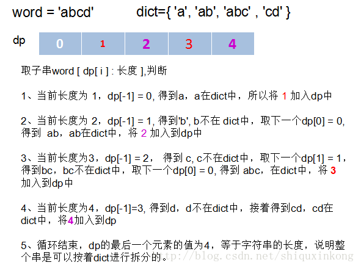

***

### [056.Merge_Intervals](../../SourceCode/Python/056.Merge_Intervals.py) Level: Medium Tags: [List]  
  
思路: 對Python來說不難，因為Python就有內建List排序  
把題目給的List照start值得順序排好後  
用以下的方式來判斷兩個Interal:  
1. 如果新的List裡面沒Interval，直接加入新List  
2. 如果有的話，比較新List最後一個Interval和要加入的Interval是否有重疊  
  重疊的規則: 新Interval的start值落在最後一個Interval的區間裡(相同值也算)  
  如此不斷iterate所有元素  
  新List即為答案  
  
***

### [074.Search_a_2D_Matrix](../../SourceCode/Python/074.Search_a_2D_Matrix.py) Level: Medium Tags: []
  
Time:  O(logm + logn)  
Space: O(1)  
  
思路:在一個已排序的2D List中找出某個元素  
最直觀的解法當然是用for去找，不過此解法只能得到O(n)  
既然這List已經被排序，就算它分成幾個小List  
我們還是能用BinarySearch來找出我們要的元素  
所以最佳解為O(nlog(n))  
  
***
  
### [179.Largest_Number](../../SourceCode/Python/179.Largest_Number.py) Level: Medium Tags: [Sort]

Time:  O(nlogn)  
Space: O(1)
      
思路:在一串數字中找出所能排列的最大數字  
Python雖然有內建排序  
但是我們在排序時還需要確認兩個數字接起來時誰比較大
如 201和9 單比數字時是201大
但接起來時很明顯9201比2019大  
python sort的cmp函式在這裡可以派上用場  
cmp函式:
```python
if str(a)+str(b) > str(b) + str(a):
    return 1
else:
    return -1
```

這裡要知道Python的數字string是可以比大小的  
  
***
  
### [133.Clone_Graph](../../SourceCode/Python/133.Clone_Graph.py) Level: Medium Tags: [Graph, DFS]
  
Time:  O(n)  
Space: O(n)  
  
思路：題目要求你clone一個無向圖  
就是把整個圖走一遍然後順便把圖的節點加進去而已  
DFS或BFS皆可  
  
  
***
  
### [139.Word_Break](../../SourceCode/Python/139.Word_Break.py) Level: Medium Tags: [DP, Backtracking]
  
Time:  O(n * j), worst case is O(n^2)  
Space: O(n)    
  
思路: 給你一個用任意字母片段的List  
要你判斷用這些片段是否能湊出輸入的英文片段  
例如
```python
s = "catsandog"
wordDict = ["cats", "dog", "sand", "and", "cat"]
```
s可被字典裡的字串拼出來，所以結果為True  

第一個方法是從第一個字元開始依次向後尋找，直到找到一個可以分開的地方(斷句)，這時代表目前的substing在dictionary中    
如果找到最後都沒找到，傳回False  
  
找到第一個斷句後，接下來找下一個斷句處，就是從第一個斷句後的字元開始找連續的字串  
但此時和第一次尋找稍微不同，例如說 word = 'ab', dict= {'a', 'ab', ...}  
在從word裡找到a之後，接下來要處理的是b，我們發現b不再dict中  
但b可以和a相結合形成ab，而ab在dict中  
所以這裡的每個字串有三個選擇  

+ 自己單獨為個體到dict中尋找
+ 和前面的string合併起來一起找
+ 等後面的新字元，構成更長的substring  

以第二項來說，我們需要跟前面的string合併起來找，所以我們需要紀錄訊息來代表前面的substring  
是從哪裡分開而滿足條件的  
如此我們就能一次從離前一個substring近的部分進行結合  
例如 word = 'aab', dict= {'a', 'aab'}  
處理a時在dict中，處理下一個a也在dict中  
但再下一個b就不在dict中了  
此時就和前面的b結合形成 ab ，但發現也不在dict中  
於是繼續跟前面的substring結合形成aab，此時在dict中了  
於是word便滿足條件

第二個方法是  
在拼湊的過程中，我們會需要不斷檢查之前拼湊的結果
所以可以用Dynamic Programming解題  

首先我們先宣告一個長度比輸入字串多1的一維陣列  
除了第一個是True外，其他內容全為False，如:

|   | c | a | t | s | a | n | d | o | g |
|---|---|---|---|---|---|---|---|---|---|
| T |   |   |   |   |   |   |   |   |   |

接著我們從第一個字元c來開始掃描他們有沒有在預設的字典中  
c我們可以看到字典裡沒有這個字，所以是False
第二個字起比較複雜  
我們比較的順序會是這樣:   
ca=>a  
第三個字加入後會是:
cat=>at=>t
我們發現cat有符合字典中的字了  
所以在t的位置把False改成True  

|   | c | a | t | s | a | n | d | o | g |
|---|---|---|---|---|---|---|---|---|---|
| T |   |   | T |   |   |   |   |   |   |


第四個字母加入後會是:  
cats=>ats=>ts=>s  
和上面一樣，字典裡有cats這個字  
所以在s的位置改成True

|   | c | a | t | s | a | n | d | o | g |
|---|---|---|---|---|---|---|---|---|---|
| T |   |   | T | T |   |   |   |   |   |

第五個字母加入後是catsa  
catsa=>asta=>sta=>ta=>a  
沒什麼好說的
    
第六個字母加入後事catsan  
catsan=>astan=>tsan=>san=>an=>n  
在比到san的時候，因為san是在字典裡的字  
我們除了看san本身外，也要回頭去看扣掉san的字串比對的結果  
而扣掉san的字串是cat，之前的比對結果是True  
所以這裡我們也能填上True    

|   | c | a | t | s | a | n | d | o | g |
|---|---|---|---|---|---|---|---|---|---|
| T |   |   | T | T |   | T |   |   |   |
  
  
第七個字母加入後為 catsand，省略
第八個字母加入後為 catsando，省略
第九個字母加入後為 catsandog
catsandog=>atsandog=>tsandog=>sandog  
=>andog=>ndog=>dog=>og=>g  
在dog時，我們會去參考剩下的字串的比對結果，就是catsan
這在剛才的比對中已經證明為True了  
所以dog這裡也可以寫為True  

|   | c | a | t | s | a | n | d | o | g |
|---|---|---|---|---|---|---|---|---|---|
| T |   |   | T | T |   | T |   |   | T |

全部比完後我們看最後面的比對結果  
就是題目要的答案  
  
下圖是另一個用DP的範例  

  
***
  
### [163.Missing_Ranges](../../SourceCode/Python/163.Missing_Ranges.py) Level: Medium Tags: []
  
Time:  O(n)  
Space: O(n)
    
思路: 題目給你一組排序過的數列  
要你找個每個元素間漏掉的數字，用 a->b表示  
我們可以使用雙指標  
pre指標指向前一個元素、curr指標指向後面一個元素  
不斷的比較前一個元素和後一個元素是否有大於2的差距  
如果有的話代表有Missing range  
把這兩個元素的區間逐個印出來就大功告成  
需注意判斷lower和upper的區間
  
***
  
### [166.Fraction_to_Recurring_Decimal](../../SourceCode/Python/166.Fraction_to_Recurring_Decimal.py) Level: Medium Tags: []
  
Time:  O(logn), 
where logn is the length of result strings    
Space: O(1)    
  
思路: 題目要求你找出不同數字相除後的小數，如果有循環則在循環的數字中括號  
除了最基本的兩數相除取模和找商之外  
我們需要一個dictionary來記錄該小數點數字出現的位置  
不能直接把小數點數字加入list再去搜尋該list  
否則會無法處理小數點數字重複的情況如: 1/333=0.(003)  
  
***
  
### [200.Number_of_Islands](../../SourceCode/Python/200.Number_of_Islands.py) Level: Medium Tags: []
  
思路: 本題是找出與周圍被0包圍的1  
可以使用DFS，利用四個方向去取得每個元素的周圍是否還有0  
已經走過 (visited) 的元素我們用0標示，如此便不會再去走它  
  
***
  
### [208.Implement_Trie_(Prefix_Tree)](../../SourceCode/Python/208.Implement_Trie_(Prefix_Tree).py) Level: Medium Tags: []
  
Time:  O(n), per operation
Space: O(1)
思路:本題要求你實作一個字典樹(Trie)的insert, search和startWith  
在此之前你必須先了解字典樹是什麼  
  

  
簡單來說就是一個方便搜尋同樣Prefix單字的樹  
有同樣prefix字的單字會被插到同一條Trie  
roo節點通常為空，底下有a~z 26個子Trie  
好處是用空間換取時間  
搜尋速度比未最佳化的Hash快，只要O(n)    
壞處就是浪費空間和比不上最佳化的Hash  
雖然圖裡沒提到  
不過通常建構Trie時都會加上isword屬性  
題目有三個function要實作:    
insert、search、startwith  
比較特別的是startwith  
只要隨著輸入的字母不斷往下traversal  
在輸入的字母全跑完之前這條Trie還沒有走到底部  
就代表能找到startwith 輸入的單字  
  
***
  
### [228.Summary_Ranges](../../SourceCode/Python/228.Summary_Ranges.py) Level: Medium Tags: []
  
Time:  O(n)  
Space: O(1)  
  
思路:要你印出一個排序的正整數陣列的Range  
例如 [0,1,2,4,5,7] => ["0->2","4->5","7"]  
最簡單的方式是用兩個while  
一個while遍歷所有元素  
內層的while則是判斷遍歷的前後元素是否為連續  
連續的話則外層while的變數+1  
如此便可和進入內圈while前的變數做對照找出前後範圍  
  
  
***
  
  
  
### [230.Kth_Smallest_Element_in_a_BST](../../SourceCode/Python/230.Kth_Smallest_Element_in_a_BST.py) Level: Medium Tags: [Recursive]
  
Time:  O(max(h, k))  
h is height of tree  
Space: O(h)  
  
思路: 在一個二元樹中找出第K小的元素  
Python的話可以先traversal整個二元樹(BFS或DFS都行)    
然後對traversal後的list做sort  
如此便知道第K個元素是誰了  
一般的遞迴方法則是從左子樹走起  
遞迴尋找此二元樹的child  
每找到一個就把k減去1   
當k減到0時該元素即為答案  
  
  
***

### [240.Search_a_2D_Matrix_II](../../SourceCode/Python/240.Search_a_2D_Matrix_II.py) Level: Medium Tags: [Recursive]
  
Time:  O(row + col)  
Space: O(1)
  
思路:   
是[074.Search_a_2D_Matrix](../../SourceCode/Python/074.Search_a_2D_Matrix.py) 的衍伸題    
不同的是這次的2D Matrix是呈螺旋狀遞減，但基本還是西高東低  
所以同樣也能用遞迴解題，甚至可能用同樣的解法來解題  
只有效率的差別  
我們這次在這裡採用非遞迴的解法  
我們從該2D Matrix的最右上角開始比對  
如果比target大的話說明元素在我們的左手邊，所以目標col-1  
如果比target小的話說明元素在我們的下面，所以目標row+1    
終止條件為超過matrix的邊界  
  
  
***
  

### [246.[Locked]Strobogrammatic_Number](../../SourceCode/Python/246.[Locked]Strobogrammatic_Number.py) Level: Medium Tags: []
  
Time:  O(n)  
Space: O(1)  
  
思路:Strobogrammatic Number是對稱數，亦即左右上下翻轉都能維持原狀的數  
本題只要求上下翻轉，不過都差不多  
解法為預設一個dictionary，上面寫好應該要對應的key-value pair  
例如 1:1, 6:9, 8:8  
然後從中間切半，不斷比對左右兩邊的元素是否是dictionary預期的即可  
  
  
***

### [247.[Locked]Strobogrammatic_Number_II](../../SourceCode/Python/247.[Locked]Strobogrammatic_Number_II.py) Level: Medium Tags: [Recursive]
  
Time:  O(n^2 * 5^(n/2))
Space: O(n)
  
思路:[246.[Locked]Strobogrammatic_Number](../../SourceCode/Python/246.[Locked]Strobogrammatic_Number.py) 的衍伸題目  
這次是要求你組出一個n長度的所有對稱數  
但題目也好心的提示你要用遞迴來做，還告訴你要用n-2來當遞迴條件(因為是對稱數)  
重點就在於遞迴的參數，我們一開始呼叫帶兩個n的遞迴function  
每呼叫一次其中一個n就減2並組合可能的字串  
如此一直到減去的n為1或0即為終止條件  
最後要注意一點，最外層的數不能是0，所以需要加判斷條件去掉  

  
***

### [249.[Locked]Group_Shifted_Strings](../../SourceCode/Python/249.[Locked]Group_Shifted_Strings.py) Level: Medium Tags: []
  
Time:  O(nlogn)  
Space: O(n)  
  
思路: 題目要你把[字元間隔]一樣的字串歸類  
例如 abc 他們的字元間隔就是1，但a和z的字元間隔也是1  
所以歸類時需要有循環的觀念  
我們可以用 % 運算子做到循環的效果，來算出每個字串的字元間隔  
例如 abc就是 [1,1] xyz也是[1,1]  
由此可得這兩個字串的字元間隔相同，便可將他們歸在同一類  
我們可以把 [1,1]當作索引存到一個dictionary  
value即為歸類於此的各個字串組成的List  
  
  
***
  

### [251.[Locked]Flatten_2D_Vector](../../SourceCode/Python/251.[Locked]Flatten_2D_Vector.py) Level: Medium Tags: []
  
Time:  O(1)  
Space: O(1)  
  
思路: 題目很難弄懂  
他的要求是要你把一個2D List壓平後用2個iterator把裡面的元素印出來  
因為有iterator的要求所以其他方法都不能用  
這兩個iterator，第一個iterator疊代最外面的List  
第二個iterator疊代裡面List的元素
首先用Python內建的iter把輸入的Vector疊代化，名為x  
在hasNext方法中，檢查有沒有第二個疊代器y  
有的話就把之後next要返回的值塞入第二個疊代器指向的元素值  
對於StopIteration的處理，因為第二個疊代器已經沒有元素了  
所以需要把當前的第二個疊代器刪除，重新產生一個新的  
  
如果一開始就沒有第二個疊代器  
那就把第一個疊代器的下一個List拿來疊代化，產生一個新的  
對於StopIteration的處理，就是告訴caller下面沒有了  
  
  
***
  
### [279.Perfect_Squares](../../SourceCode/Python/279.Perfect_Squares.py) Level: Medium Tags: [DP]
  
  
思路:檢查所給的數字能被多少個完美平方數相加  
例如 13 可以分成4和9 所以答案為2  
這題雖然可以用數學定理的四平方和解題  
( Lagrange's four-square theorem，每個正整數均可表示為4個整數的平方和 )  
但我們在面試中不太可能碰到剛好能用數學定理解題的情況，還是考慮一般解吧。  
此題需要使用的是Dynamic Programming  
而且屬於重疊子問題 (自上而下 ): 每個子問題只解一次，把解保存在一個需要時就可以查看的表中  
每次查表的時間為常數  
  
首先把輸入的正整數所有的完全平方數都找出來並在dp紀錄上填上1  
它是我們之後dynamic programming的依據  
接著從1開始找每個整數(x)加另一個從1開始整數的平方(y)  
例如 x+y*y  
看他們的和是否小於等於n  
是的話就能加入我們的dp筆記     
如果沒寫過的話，就能直接從dp[x]加1(這個1是找到的y給的)  
如果寫過的話，就比較目前筆記裡寫過的值+1有沒有小於目前值  
比較小的話當然採用dp[x]+1  
如此走完整個迴圈，則dp[n]即為答案  
  
  
***
  
### [280.[Locked]Wiggle_Sort](../../SourceCode/Python/280.[Locked]Wiggle_Sort.py) Level: Medium Tags: [Sort]
  
Time:  O(n)  
Space: O(1)  
  
思路:把輸入的陣列元素按照山峰的形狀排列  
nums[0] <= nums[1] >= nums[2] <= nums[3]....  
對於Python來說很簡單的一題  
先用sort排序後，每隔2個元素互相交換其值  
便能達到搖擺排序的效果了  
  
  
***
  
### [289.Game_of_Life](../../SourceCode/Python/289.Game_of_Life.py) Level: Medium Tags: [List, Bit manipulation]
  
Time:  O(m * n)  
Space: O(m * n)  Follow up: O(1)    
  
思路:題目非常的長，大部分的篇幅在講解有名的生命遊戲 (Game of Life)    
如果你寫過的話便能很快上手  
簡單來說，給你一個0與1構成的多維陣列，每個元素代表一個元素的狀態    
1代表活、0代表死  
對任何細胞來說，他的鄰居有2~3個都是活的，他下一次的狀態就是活的  
反之則代表下一次狀態細胞會死亡    
因為題目要求直接對輸入的陣列做in-place操作  
我們需要多拷貝一個陣列來記錄原本的狀態  
然後寫另外一個函式來比較每個元素的周圍八個方向有多少個活細胞  
計算出來後我們便能得知每個細胞下一個狀態的生死了  
  
Follow up要求我們在不能使用額外空間的情況下得出陣列的下一個狀態  
此時需要使用 Bit manipulation　來統計細胞的狀態　　
1. 00 : Dead -> Dead  

2. 01 : Live -> Live  

3. 10 : Live -> Dead  

4. 11 : Dead -> Live  
最關鍵的Bit為 2(10) 和 3(11)  
把之前的程式碼判斷"生轉死"或"死轉生"的部分改成bit標示    
你會得到一個由0~3組成的新陣列  
接著用 1做and運算便可得知下一個陣列的狀態  
然而計算鄰居個數的部分此時也需要做相對應的修改    
因為你統計鄰居時可能會統計到生轉死(2)的細胞  
統計到此細胞的時候需要把它改成3，也就是翻盤的狀態  
  
***
  
### [341.Flatten_Nested_List_Iterator](../../SourceCode/Python/341.Flatten_Nested_List_Iterator.py) Level: Medium Tags: []
  
Time:  O(n), n is the number of the integers.  
Space: O(h), h is the depth of the nested lists.  
  
思路:本題要你用iterator把所有巢狀List中的元素疊代出來  
和  [251.[Locked]Flatten_2D_Vector](../../SourceCode/Python/251.[Locked]Flatten_2D_Vector.py) 有點相似    
可是251題的Input全部都是List而這題有時Input會有數字    
因為iter有個條件是要疊代的元素需要全部屬於同一種type  
所以我們不能用251題的解法來解此題  
我們可以用一個List代表要疊代的元素，依次把原本List中的元素倒給他    
之後的next方法就只是pop這List裡的第一個元素了  
hasNext方法中，有一個很重要的步驟是當我們的List接到元素時    
需要判斷接到的是數字或是List  
List的話還需要對他做進一步的處理才能給next方法用    
  
如果Input的List和我們的List都空了  
說明後面已經沒有東西能疊代了  
此時就能return False  
  
***
  
### [324.Wiggle_Sort_II](../../SourceCode/Python/324.Wiggle_Sort_II.py) Level: Medium Tags: [Sort]
  
Time:  O(nlogn)  
Space: O(n)  
  
思路:是[280.[Locked]Wiggle_Sort](../../SourceCode/Python/280.[Locked]Wiggle_Sort.py) 的衍伸  
和280不同的是peak間的元素不能相等，所以原本的方法不能用了  
但解法其實也不難  
把原本的陣列先排序好之後存到另一個陣列  
然後在新陣列中找出最中間的元素  
依照這中位數元素把新陣列分成左右半邊  
由此可知左邊一定是小元素，右邊一定是大元素    
接著使用一套準則來填充新元素到舊陣列裡(因為題目要求return為原本的陣列):  
1. 把較小半邊的小陣列取最後一個，較大元素的小陣列取最後一個  
2. 把舊陣列的第一、二元素分別填上小陣列取的值和大陣列取的值
3. 重複1和2，把舊陣列的值填完    
照上述步驟便可排序完成     
  
  
Follow up是挺難的題目  
思路如下:  
1. 使用Quick排序，從未經排序的nums中挑選出mid  
2. 參考一開始的思路，把nums陣列的下標從  
[0, 1, 2, ... , n-1, n] mapping到  
[1, 3, 5, ...., 0, 2, 4,...]得到新的下標  
3. 以中位數mid為界，將大於mid的元素排列在新下標的較小部分  
而將小於mid的元素排列在新下標的叫大部分  
  
***
  


 
  