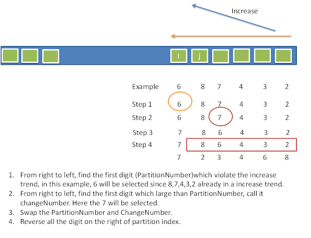

***

### [031.Next_Permutation](../../SourceCode/Python/031.Next_Permutation.py) Level: Medium Tags: [Tricky]  
  
Time:  O(n)  
Space: O(1)
    
思路: 給你一個數字組成的數列  
要你找出他的下一個排列比他大的數字  
例如[1,4,5,3,2] =>  [1,5,2,3,4]  
如果找不到比他大的數，就找最小的數  
如[3,2,1] => [1,2,3]  
這題的解法非常巧妙，據說是STL的演算法  
可以見圖解說  

  
我們這裡拿上面的數列做例子  
1. 從右往左找出兩個數字為升序排列的  
這裡是4和5，我們稱4為partition number  
2. 從右找出第一個比partition number大的數字  
這裡是5，我們叫他change number  
3. 把partition number和change number做交換
所以數列變成[1,5,4,3,2]
4. 從原本partition number在的index後面開始  
把其後的數列做反轉  
[1,5,4,3,2] => [1,5,2,3,4]
5. 此數列即為題目要求的答案  
  
  
***

### [056.Merge_Intervals](../../SourceCode/Python/056.Merge_Intervals.py) Level: Medium Tags: [List]  
  
思路: 對Python來說不難，因為Python就有內建List排序  
把題目給的List照start值得順序排好後  
用以下的方式來判斷兩個Interal:  
1. 如果新的List裡面沒Interval，直接加入新List  
2. 如果有的話，比較新List最後一個Interval和要加入的Interval是否有重疊  
  重疊的規則: 新Interval的start值落在最後一個Interval的區間裡(相同值也算)  
  如此不斷iterate所有元素  
  新List即為答案  
  
***

### [074.Search_a_2D_Matrix](../../SourceCode/Python/074.Search_a_2D_Matrix.py) Level: Medium Tags: []
  
Time:  O(logm + logn)  
Space: O(1)  
  
思路:在一個已排序的2D List中找出某個元素  
最直觀的解法當然是用for去找，不過此解法只能得到O(n)  
既然這List已經被排序，就算它分成幾個小List  
我們還是能用BinarySearch來找出我們要的元素  
所以最佳解為O(nlog(n))  
  
  
***

### [079.Word_Search](../../SourceCode/Python/079.Word_Search.py) Level: Medium Tags: [DFS]
  
Time:  O(m * n * k)  
Space: O(k)  
k is length of word
  
思路: 給你一個由字母組成的2維陣列和一個單字  
要你判斷這個單字能不能在這陣列中找到   
這是個典型的深度搜索(DFS)問題  
我們可以把每一個端點都當作起點  
然後從這端點進行上下左右的DFS  
下一個端點如果是我們預期的字母就繼續同樣的動作  
反之如果超過邊界，或是不是我們預期的字母就返回False  
返回True的條件看要怎麼寫  
我這裡是如果現在搜尋到的是我們預期的字母  
就把這個字母從目前的單字裡移除  
如此一來返回True的條件就是這個單字變數變為空字串  
  
在搜尋過程中我們要防止自己走過的地方又走回來  
這裡有很多種方式，只要和原本走過的字母不同就可以  
例如改為'.'、'#' 等等  
Python的話可以用swapcase變換字母大小  
寫起來稍微優雅些  
  
  
***
  
### [179.Largest_Number](../../SourceCode/Python/179.Largest_Number.py) Level: Medium Tags: [Sort]

Time:  O(nlogn)  
Space: O(1)
      
思路:在一串數字中找出所能排列的最大數字  
Python雖然有內建排序  
但是我們在排序時還需要確認兩個數字接起來時誰比較大
如 201和9 單比數字時是201大
但接起來時很明顯9201比2019大  
python sort的cmp函式在這裡可以派上用場  
cmp函式:
```python
if str(a)+str(b) > str(b) + str(a):
    return 1
else:
    return -1
```

這裡要知道Python的數字string是可以比大小的  
  
***
  
### [133.Clone_Graph](../../SourceCode/Python/133.Clone_Graph.py) Level: Medium Tags: [Graph, DFS]
  
Time:  O(n)  
Space: O(n)  
  
思路：題目要求你clone一個無向圖  
就是把整個圖走一遍然後順便把圖的節點加進去而已  
DFS或BFS皆可  
  
  
***
  
### [139.Word_Break](../../SourceCode/Python/139.Word_Break.py) Level: Medium Tags: [DP, Backtracking]
  
Time:  O(n * j), worst case is O(n^2)  
Space: O(n)    
  
思路: 給你一個用任意字母片段的List  
要你判斷用這些片段是否能湊出輸入的英文片段  
例如
```python
s = "catsandog"
wordDict = ["cats", "dog", "sand", "and", "cat"]
```
s可被字典裡的字串拼出來，所以結果為True  

第一個方法是從第一個字元開始依次向後尋找，直到找到一個可以分開的地方(斷句)，這時代表目前的substing在dictionary中    
如果找到最後都沒找到，傳回False  
  
找到第一個斷句後，接下來找下一個斷句處，就是從第一個斷句後的字元開始找連續的字串  
但此時和第一次尋找稍微不同，例如說 word = 'ab', dict= {'a', 'ab', ...}  
在從word裡找到a之後，接下來要處理的是b，我們發現b不再dict中  
但b可以和a相結合形成ab，而ab在dict中  
所以這裡的每個字串有三個選擇  

+ 自己單獨為個體到dict中尋找
+ 和前面的string合併起來一起找
+ 等後面的新字元，構成更長的substring  

以第二項來說，我們需要跟前面的string合併起來找，所以我們需要紀錄訊息來代表前面的substring  
是從哪裡分開而滿足條件的  
如此我們就能一次從離前一個substring近的部分進行結合  
例如 word = 'aab', dict= {'a', 'aab'}  
處理a時在dict中，處理下一個a也在dict中  
但再下一個b就不在dict中了  
此時就和前面的b結合形成 ab ，但發現也不在dict中  
於是繼續跟前面的substring結合形成aab，此時在dict中了  
於是word便滿足條件

第二個方法是  
在拼湊的過程中，我們會需要不斷檢查之前拼湊的結果
所以可以用Dynamic Programming解題  

首先我們先宣告一個長度比輸入字串多1的一維陣列  
除了第一個是True外，其他內容全為False，如:

|   | c | a | t | s | a | n | d | o | g |
|---|---|---|---|---|---|---|---|---|---|
| T |   |   |   |   |   |   |   |   |   |

接著我們從第一個字元c來開始掃描他們有沒有在預設的字典中  
c我們可以看到字典裡沒有這個字，所以是False
第二個字起比較複雜  
我們比較的順序會是這樣:   
ca=>a  
第三個字加入後會是:
cat=>at=>t
我們發現cat有符合字典中的字了  
所以在t的位置把False改成True  

|   | c | a | t | s | a | n | d | o | g |
|---|---|---|---|---|---|---|---|---|---|
| T |   |   | T |   |   |   |   |   |   |


第四個字母加入後會是:  
cats=>ats=>ts=>s  
和上面一樣，字典裡有cats這個字  
所以在s的位置改成True

|   | c | a | t | s | a | n | d | o | g |
|---|---|---|---|---|---|---|---|---|---|
| T |   |   | T | T |   |   |   |   |   |

第五個字母加入後是catsa  
catsa=>asta=>sta=>ta=>a  
沒什麼好說的
    
第六個字母加入後事catsan  
catsan=>astan=>tsan=>san=>an=>n  
在比到san的時候，因為san是在字典裡的字  
我們除了看san本身外，也要回頭去看扣掉san的字串比對的結果  
而扣掉san的字串是cat，之前的比對結果是True  
所以這裡我們也能填上True    

|   | c | a | t | s | a | n | d | o | g |
|---|---|---|---|---|---|---|---|---|---|
| T |   |   | T | T |   | T |   |   |   |
  
  
第七個字母加入後為 catsand，省略
第八個字母加入後為 catsando，省略
第九個字母加入後為 catsandog
catsandog=>atsandog=>tsandog=>sandog  
=>andog=>ndog=>dog=>og=>g  
在dog時，我們會去參考剩下的字串的比對結果，就是catsan
這在剛才的比對中已經證明為True了  
所以dog這裡也可以寫為True  

|   | c | a | t | s | a | n | d | o | g |
|---|---|---|---|---|---|---|---|---|---|
| T |   |   | T | T |   | T |   |   | T |

全部比完後我們看最後面的比對結果  
就是題目要的答案  
  
下圖是另一個用DP的範例  

  
***
  
### [163.Missing_Ranges](../../SourceCode/Python/163.Missing_Ranges.py) Level: Medium Tags: []
  
Time:  O(n)  
Space: O(n)
    
思路: 題目給你一組排序過的數列  
要你找個每個元素間漏掉的數字，用 a->b表示  
我們可以使用雙指標  
pre指標指向前一個元素、curr指標指向後面一個元素  
不斷的比較前一個元素和後一個元素是否有大於2的差距  
如果有的話代表有Missing range  
把這兩個元素的區間逐個印出來就大功告成  
需注意判斷lower和upper的區間
  
***
  
### [166.Fraction_to_Recurring_Decimal](../../SourceCode/Python/166.Fraction_to_Recurring_Decimal.py) Level: Medium Tags: []
  
Time:  O(logn), 
where logn is the length of result strings    
Space: O(1)    
  
思路: 題目要求你找出不同數字相除後的小數，如果有循環則在循環的數字中括號  
除了最基本的兩數相除取模和找商之外  
我們需要一個dictionary來記錄該小數點數字出現的位置  
不能直接把小數點數字加入list再去搜尋該list  
否則會無法處理小數點數字重複的情況如: 1/333=0.(003)  
  
***
  
### [200.Number_of_Islands](../../SourceCode/Python/200.Number_of_Islands.py) Level: Medium Tags: []
  
思路: 本題是找出與周圍被0包圍的1  
可以使用DFS，利用四個方向去取得每個元素的周圍是否還有0  
已經走過 (visited) 的元素我們用0標示，如此便不會再去走它  
  
***
  
### [208.Implement_Trie_(Prefix_Tree)](../../SourceCode/Python/208.Implement_Trie_(Prefix_Tree).py) Level: Medium Tags: []
  
Time:  O(n), per operation
Space: O(1)
思路:本題要求你實作一個字典樹(Trie)的insert, search和startWith  
在此之前你必須先了解字典樹是什麼  
  

  
簡單來說就是一個方便搜尋同樣Prefix單字的樹  
有同樣prefix字的單字會被插到同一條Trie  
roo節點通常為空，底下有a~z 26個子Trie  
好處是用空間換取時間  
搜尋速度比未最佳化的Hash快，只要O(n)    
壞處就是浪費空間和比不上最佳化的Hash  
雖然圖裡沒提到  
不過通常建構Trie時都會加上isword屬性  
題目有三個function要實作:    
insert、search、startwith  
比較特別的是startwith  
只要隨著輸入的字母不斷往下traversal  
在輸入的字母全跑完之前這條Trie還沒有走到底部  
就代表能找到startwith 輸入的單字  
  
***
  
### [228.Summary_Ranges](../../SourceCode/Python/228.Summary_Ranges.py) Level: Medium Tags: []
  
Time:  O(n)  
Space: O(1)  
  
思路:要你印出一個排序的正整數陣列的Range  
例如 [0,1,2,4,5,7] => ["0->2","4->5","7"]  
最簡單的方式是用兩個while  
一個while遍歷所有元素  
內層的while則是判斷遍歷的前後元素是否為連續  
連續的話則外層while的變數+1  
如此便可和進入內圈while前的變數做對照找出前後範圍  
  
  
***
  
  
  
### [230.Kth_Smallest_Element_in_a_BST](../../SourceCode/Python/230.Kth_Smallest_Element_in_a_BST.py) Level: Medium Tags: [Recursive]
  
Time:  O(max(h, k))  
h is height of tree  
Space: O(h)  
  
思路: 在一個二元樹中找出第K小的元素  
Python的話可以先traversal整個二元樹(BFS或DFS都行)    
然後對traversal後的list做sort  
如此便知道第K個元素是誰了  
一般的遞迴方法則是從左子樹走起  
遞迴尋找此二元樹的child  
每找到一個就把k減去1   
當k減到0時該元素即為答案  
  
  
***

### [240.Search_a_2D_Matrix_II](../../SourceCode/Python/240.Search_a_2D_Matrix_II.py) Level: Medium Tags: [Recursive]
  
Time:  O(row + col)  
Space: O(1)
  
思路:   
是[074.Search_a_2D_Matrix](../../SourceCode/Python/074.Search_a_2D_Matrix.py) 的衍伸題    
不同的是這次的2D Matrix是呈螺旋狀遞減，但基本還是西高東低  
所以同樣也能用遞迴解題，甚至可能用同樣的解法來解題  
只有效率的差別  
我們這次在這裡採用非遞迴的解法  
我們從該2D Matrix的最右上角開始比對  
如果比target大的話說明元素在我們的左手邊，所以目標col-1  
如果比target小的話說明元素在我們的下面，所以目標row+1    
終止條件為超過matrix的邊界  
這種搜尋方式稱為階梯式搜尋  
  
  
***
  

### [246.[Locked]Strobogrammatic_Number](../../SourceCode/Python/246.[Locked]Strobogrammatic_Number.py) Level: Medium Tags: []
  
Time:  O(n)  
Space: O(1)  
  
思路:Strobogrammatic Number是對稱數，亦即左右上下翻轉都能維持原狀的數  
本題只要求上下翻轉，不過都差不多  
解法為預設一個dictionary，上面寫好應該要對應的key-value pair  
例如 1:1, 6:9, 8:8  
然後從中間切半，不斷比對左右兩邊的元素是否是dictionary預期的即可  
  
  
***

### [247.[Locked]Strobogrammatic_Number_II](../../SourceCode/Python/247.[Locked]Strobogrammatic_Number_II.py) Level: Medium Tags: [Recursive]
  
Time:  O(n^2 * 5^(n/2))
Space: O(n)
  
思路:[246.[Locked]Strobogrammatic_Number](../../SourceCode/Python/246.[Locked]Strobogrammatic_Number.py) 的衍伸題目  
這次是要求你組出一個n長度的所有對稱數  
但題目也好心的提示你要用遞迴來做，還告訴你要用n-2來當遞迴條件(因為是對稱數)  
重點就在於遞迴的參數，我們一開始呼叫帶兩個n的遞迴function  
每呼叫一次其中一個n就減2並組合可能的字串  
如此一直到減去的n為1或0即為終止條件  
最後要注意一點，最外層的數不能是0，所以需要加判斷條件去掉  

  
***

### [249.[Locked]Group_Shifted_Strings](../../SourceCode/Python/249.[Locked]Group_Shifted_Strings.py) Level: Medium Tags: []
  
Time:  O(nlogn)  
Space: O(n)  
  
思路: 題目要你把[字元間隔]一樣的字串歸類  
例如 abc 他們的字元間隔就是1，但a和z的字元間隔也是1  
所以歸類時需要有循環的觀念  
我們可以用 % 運算子做到循環的效果，來算出每個字串的字元間隔  
例如 abc就是 [1,1] xyz也是[1,1]  
由此可得這兩個字串的字元間隔相同，便可將他們歸在同一類  
我們可以把 [1,1]當作索引存到一個dictionary  
value即為歸類於此的各個字串組成的List  
  
  
***
  

### [251.[Locked]Flatten_2D_Vector](../../SourceCode/Python/251.[Locked]Flatten_2D_Vector.py) Level: Medium Tags: []
  
Time:  O(1)  
Space: O(1)  
  
思路: 題目很難弄懂  
他的要求是要你把一個2D List壓平後用2個iterator把裡面的元素印出來  
因為有iterator的要求所以其他方法都不能用  
這兩個iterator，第一個iterator疊代最外面的List  
第二個iterator疊代裡面List的元素
首先用Python內建的iter把輸入的Vector疊代化，名為x  
在hasNext方法中，檢查有沒有第二個疊代器y  
有的話就把之後next要返回的值塞入第二個疊代器指向的元素值  
對於StopIteration的處理，因為第二個疊代器已經沒有元素了  
所以需要把當前的第二個疊代器刪除，重新產生一個新的  
  
如果一開始就沒有第二個疊代器  
那就把第一個疊代器的下一個List拿來疊代化，產生一個新的  
對於StopIteration的處理，就是告訴caller下面沒有了  
  
  
***
  
### [279.Perfect_Squares](../../SourceCode/Python/279.Perfect_Squares.py) Level: Medium Tags: [DP]
  
  
思路:檢查所給的數字能被多少個完美平方數相加  
例如 13 可以分成4和9 所以答案為2  
這題雖然可以用數學定理的四平方和解題  
( Lagrange's four-square theorem，每個正整數均可表示為4個整數的平方和 )  
但我們在面試中不太可能碰到剛好能用數學定理解題的情況，還是考慮一般解吧。  
此題需要使用的是Dynamic Programming  
而且屬於重疊子問題 (自上而下 ): 每個子問題只解一次，把解保存在一個需要時就可以查看的表中  
每次查表的時間為常數  
  
首先把輸入的正整數所有的完全平方數都找出來並在dp紀錄上填上1  
它是我們之後dynamic programming的依據  
接著從1開始找每個整數(x)加另一個從1開始整數的平方(y)  
例如 x+y*y  
看他們的和是否小於等於n  
是的話就能加入我們的dp筆記     
如果沒寫過的話，就能直接從dp[x]加1(這個1是找到的y給的)  
如果寫過的話，就比較目前筆記裡寫過的值+1有沒有小於目前值  
比較小的話當然採用dp[x]+1  
如此走完整個迴圈，則dp[n]即為答案  
  
  
***
  
### [280.[Locked]Wiggle_Sort](../../SourceCode/Python/280.[Locked]Wiggle_Sort.py) Level: Medium Tags: [Sort]
  
Time:  O(n)  
Space: O(1)  
  
思路:把輸入的陣列元素按照山峰的形狀排列  
nums[0] <= nums[1] >= nums[2] <= nums[3]....  
對於Python來說很簡單的一題  
先用sort排序後，每隔2個元素互相交換其值  
便能達到搖擺排序的效果了  
  
  
***
  
### [284.Peeking_Iterator](../../SourceCode/Python/284.Peeking_Iterator.py) Level: Medium Tags: [Iterator]
   
Time:  O(1) per peek(), next(), hasNext()  
Space: O(1)   
  
思路:要你在一個為Iterator基礎的iterator建立其相關method  
例如next、hasNext,peek等  
因為Python沒有內建hasNext，所以這method建立稍麻煩點  
peek也是題目特別要求的method  
關於hasNext的部分，我們可以用題目已經提供的hasNext method  
(有興趣的話可以看Soruce code裡題目提供的hasNext())  
peek的要求是告訴我們下一個元素的值  
因為內建的next會自動疊代到下一個元素  
所以我們需要設一個peekflag，預設為False  
當peek被呼叫時把next得到的元素存到另一個全域變數去
然後把peekflag設為True  
如此當之後呼叫該class的next()時  
我們可以看peekflag查之前有沒有呼叫過peek()  
有的話就直接return全域變數內存的值  
並把相關的變數重設回預設值  
反之的話就能直接呼叫該iterator的next來取值  
    
    
***
  
### [289.Game_of_Life](../../SourceCode/Python/289.Game_of_Life.py) Level: Medium Tags: [List, Bit manipulation]
  
Time:  O(m * n)  
Space: O(m * n)  Follow up: O(1)    
  
思路:題目非常的長，大部分的篇幅在講解有名的生命遊戲 (Game of Life)    
如果你寫過的話便能很快上手  
簡單來說，給你一個0與1構成的多維陣列，每個元素代表一個元素的狀態    
1代表活、0代表死  
對任何細胞來說，他的鄰居有2~3個都是活的，他下一次的狀態就是活的  
反之則代表下一次狀態細胞會死亡    
因為題目要求直接對輸入的陣列做in-place操作  
我們需要多拷貝一個陣列來記錄原本的狀態  
然後寫另外一個函式來比較每個元素的周圍八個方向有多少個活細胞  
計算出來後我們便能得知每個細胞下一個狀態的生死了  
  
Follow up要求我們在不能使用額外空間的情況下得出陣列的下一個狀態  
此時需要使用 Bit manipulation　來統計細胞的狀態　　
1. 00 : Dead -> Dead  

2. 01 : Live -> Live  

3. 10 : Live -> Dead  

4. 11 : Dead -> Live  
最關鍵的Bit為 2(10) 和 3(11)  
把之前的程式碼判斷"生轉死"或"死轉生"的部分改成bit標示    
你會得到一個由0~3組成的新陣列  
接著用 1做and運算便可得知下一個陣列的狀態  
然而計算鄰居個數的部分此時也需要做相對應的修改    
因為你統計鄰居時可能會統計到生轉死(2)的細胞  
統計到此細胞的時候需要把它改成3，也就是翻盤的狀態  
  
  
***
  
### [309.Best_Time_to_Buy_and_Sell_Stock_with_Cooldown](../../SourceCode/Python/309.Best_Time_to_Buy_and_Sell_Stock_with_Cooldown.py) Level: Medium Tags: [DP]
  
Time:  O(n)  
Space: O(n)  
  
思路: 是[122.Best_Time_to_Buy_and_Sell_Stock_II](../../SourceCode/Python/122.Best_Time_to_Buy_and_Sell_Stock_II.py)   
     和[121.Best_Time_to_Buy_and_Sell_Stock_II](../../SourceCode/Python/121.Best_Time_to_Buy_and_Sell_Stock.py) 的延伸  
如果不熟動態規劃()Dynamic Programming)的話  
這題可以算是Hard了  
題目和之前幾題一樣都要求買低賣高，但多了冷卻期  
也就是賣出後的那一天不能買進股票  
如果你第一天買入，第二天賣出的話  
你得等第四天後才能買進第二筆  
  
這裡用動態規劃需要令兩個List  
分別是buy和sell，長度為prices長度  
buy[i]和sell[i]分別代表第i天持股股票的最大利潤  
和第i天賣出股票時的最大利潤  
這裡我們要寫出他們的狀態轉移方程  
對於buy[i]，最大利潤有兩種可能:  
1. 前一天的持股buy[i-1]，到今天仍未賣出  
2. 之前賣出股票後今天買了股票，花掉了prices[i]
因為有一天的冷卻期，所以是sell[i-2]-prices[i]  
第i天的買進最大利潤就為  
```python
buy[i] = max(buy[i-1], sell[i-2] - prices[i]
```
  
對於sell[i]，最大利潤有兩種可能:  
1. 前一天賣出後，今天仍然沒買進股票  
所以最大利潤是sell[i-1]  
2. 前一天買進後，今天賣出持股得到了今天股價prices[i]  
所以是buy[i-1] + prices[i]  
所以我們可以知道sell[i]的最大利潤為:  
```python
sell[i] = max(sell[i-1], buy[i-1] + prices[i])
```
  
不斷轉移狀態到最後一天賣出持股 (sell[len(prices)-1])  
就是我們所能達到的最大利潤了  
  
  
***
  
### [318.Maximum_Product_of_Word_Lengths](../../SourceCode/Python/318.Maximum_Product_of_Word_Lengths.py) Level: Medium Tags: [Bit Manipulation]
  
Time:  O(n^2)  
Space: O(n)  (用Bit可再降低點空間複雜度)  
  
思路: 給你一組由不同單字組成的陣列  
要你找出每兩個單字所能組成的最大乘積  
這兩個單字必須要沒有共同字母才能相乘  
例如 ["abcw","baz","foo","bar","xtfn","abcdef"]  
因為"abcw" 和 "abcdef"有共同字母，所以不能相乘  
因為有共同字母的限制，所以我們在找最大乘積前得先解決這個問題  
單純的相互比對字串會造成超時 (Time Limit Exceed)  
所以我們要用其他方式來加速比對  
網路上推薦使用Bit操作，因為題目描述限制字母只有小寫  
一個32bit的整數就能囊括26個英文字母  
不過也能使用Python的Set來操作  
先把每個單字分別儲存到不同的Set中，再交叉比對作聯集  
如果是空集合就代表符合題目要求  
不斷循環找出最大乘積即為答案  
  
  
***
  
### [324.Wiggle_Sort_II](../../SourceCode/Python/324.Wiggle_Sort_II.py) Level: Medium Tags: [Sort]
  
Time:  O(nlogn)  
Space: O(n)  
  
思路:是[280.[Locked]Wiggle_Sort](../../SourceCode/Python/280.[Locked]Wiggle_Sort.py) 的衍伸  
和280不同的是peak間的元素不能相等，所以原本的方法不能用了  
但解法其實也不難  
把原本的陣列先排序好之後存到另一個陣列  
然後在新陣列中找出最中間的元素  
依照這中位數元素把新陣列分成左右半邊  
由此可知左邊一定是小元素，右邊一定是大元素    
接著使用一套準則來填充新元素到舊陣列裡(因為題目要求return為原本的陣列):  
1. 把較小半邊的小陣列取最後一個，較大元素的小陣列取最後一個  
2. 把舊陣列的第一、二元素分別填上小陣列取的值和大陣列取的值
3. 重複1和2，把舊陣列的值填完    
照上述步驟便可排序完成     
  
  
Follow up是挺難的題目  
思路如下:  
1. 使用Quick排序，從未經排序的nums中挑選出mid  
2. 參考一開始的思路，把nums陣列的下標從  
[0, 1, 2, ... , n-1, n] mapping到  
[1, 3, 5, ...., 0, 2, 4,...]得到新的下標  
3. 以中位數mid為界，將大於mid的元素排列在新下標的較小部分  
而將小於mid的元素排列在新下標的叫大部分  
  
***
  
### [341.Flatten_Nested_List_Iterator](../../SourceCode/Python/341.Flatten_Nested_List_Iterator.py) Level: Medium Tags: [Iterator]
  
Time:  O(n), n is the number of the integers.  
Space: O(h), h is the depth of the nested lists.  
  
思路:本題要你用iterator把所有巢狀List中的元素疊代出來  
和  [251.[Locked]Flatten_2D_Vector](../../SourceCode/Python/251.[Locked]Flatten_2D_Vector.py) 有點相似    
可是251題的Input全部都是List而這題有時Input會有數字    
因為iter有個條件是要疊代的元素需要全部屬於同一種type  
所以我們不能用251題的解法來解此題  
我們可以用一個List代表要疊代的元素，依次把原本List中的元素倒給他    
之後的next方法就只是pop這List裡的第一個元素了  
hasNext方法中，有一個很重要的步驟是當我們的List接到元素時    
需要判斷接到的是數字或是List  
List的話還需要對他做進一步的處理才能給next方法用    
  
如果Input的List和我們的List都空了  
說明後面已經沒有東西能疊代了  
此時就能return False  
  
   
***  
  
### [357.Count_Numbers_with_Unique_Digits](../../SourceCode/Python/357.Count_Numbers_with_Unique_Digits.py) Level: Medium Tags: [Math]
  
Time: O(n)   
Space: O(1)
    
思路: 給你一個x，0 <= x < 10^n  
要你求在這範圍內所有不重複數字的數字  
例如x = 2時，11,22,33....99就不能算，如此共有100-19=81個數字  
直覺的作法是把每個數字挑出來去檢查是否有重複數字的數字  
但此法很明顯的在n越大時他的時間複雜度會是指數級的O(10^n)  
所以不可能用此解法  
這裡我們用簡單的排列組合來解題  
n = 1 時，可以有0~9個數字的排列組合共10個數字  
n = 2 時，十位數不能用0所以只能用1~9  
個位數則從10個少了1個數字  
所以有 9*9 共81個組合  
n = 3 時，只剩8個數字可選  
所以是 9*9*8的組合  
n繼續往上加可以很容易地發現能使用的數字持續減少  
到n=11時已經完全不可能有不重複的數字  
我們可以用一個陣列存使用的數字  
即  [9, 9, 8, 7, 6, 5, 4, 3, 2, 1]  
接著看題目給的n多少就從這陣列拿多少進去算  
不過這種算法只能算 n 個數字的組合  
我們要從1算到n然後全部作加總  
如此便為題目所求  

其實這題根本是數學題  
甚至你可以先算出來每個n的組合直接return結果  
所以這題的差評很多
     
   
***  
  
### [375.Guess_Number_Higher_or_Lower_II](../../SourceCode/Python/375.Guess_Number_Higher_or_Lower_II.py) Level: Medium Tags: [DP]
  
Time:  O(n^2)  
Space: O(n^2)  
    
思路: 是[374.Guess_Number_Higher_or_Lower](../../SourceCode/Python/374.Guess_Number_Higher_or_Lower.py) 的衍伸題  
但解法完全不同  
雖然一樣是猜數字，但這次每猜一個數字你就要多花該數字的錢  
給你一個數字為n的範圍，如果n=10的話  
就要你找出猜1~10範圍內數字猜中所需花費的最小金錢  
這是一個Dynamic Programming的題目 (DP) 
因為每個範圍內的結果都是之前範圍可以推得的  
我們在這裡宣告一個 (n+1) * (n+1) 的2維DP陣列  
每行每列分別代表猜[行~列]範圍內的數字  
例如[第一行, 第十列] 就是 1~10內的猜數字    
所以算出 dp[1][10]就是答案  
  
底下我們用n=5來作範例   
當我們在猜範圍1~5的數字時  
如果今天答案是5而我們猜4，會得到太小的結果  
這時下一次就一定能猜到答案就是5了  
但我們並不能預期題目會主動告訴我們太大還是太小  
所以我們不論太大的結果或太小的結果都要算  
然後取他們的最小值  
假如我們猜了一個數字k  
這時會產生三種成本:  
1. 猜中了，那成本就是這個k的大小  
2. k太大，那成本就是k加上猜 (1, k-1) 的範圍內保證能贏所需的錢    
3. k太小，那成本就是k加上猜 (k+1, n) 的範圍內保證能贏所需的錢  
  
上面這三個情況可以寫成  
1. guess = k
2. guess = k + dp[1][k-1]  
3. guess = k + dp[k+1][n]  
  
我們每猜一個K最高就是需要花上  
max(k, dp[1][k-1], dp[k+1][n])
因為k是非得花下去的金錢，我們可以把他抽出來  
變成 max(dp[1][k-1], dp[k+1][n]) + k    
所以我們要求的最小成本就是  
依次求出猜每個數所得到的最大成本  
然後取他們的最小值  
即為題目要求的最低成本  

n為5的動態表格如下表，初始值都是0  

|   |   | 1 | 2 | 3 | 4 | 5 |
|---|---|---|---|---|---|---|
|   |   |   |   |   |   |   |
| 1 |   |   |   |   |   |   |
| 2 |   |   |   |   |   |   |
| 3 |   |   |   |   |   |   |
| 4 |   |   |   |   |   |   |
| 5 |   |   |   |   |   |   |
      
  
這裡計算的範圍和一般的印象有點不同，大體上是這樣的:
我們先從最右邊的範圍找起，如下圖
```
         guess -->
1  2  3    4     5
           i <-> j
```
```
       guess -->
1  2     3    4     5
         i   <--->  j
```
```
  guess ----->
1  2     3    4     5
   i    <-------->  j
```
也就是每次先界定好要猜數字的範圍  
然後從左邊猜到右邊來算出最小成本  
  
照上圖找法
我們從i->left=4、j->right=5的範圍先找起  
在這範圍內很明顯你的最低成本只可能是4  
所以我們先在這裡填上4
    

|   |   | 1 | 2 | 3 | 4 | 5 |
|---|---|---|---|---|---|---|
|   |   |   |   |   |   |   |
| 1 |   |   |   |   |   |   |
| 2 |   |   |   |   |   |   |
| 3 |   |   |   |   |   |   |
| 4 |   |   |   |   |   | 4 |
| 5 |   |   |   |   |   |   |      
      
下一個要填的是left=3、right=5的範圍  
如果範圍縮小到3~4的話，很容易得出最高成本為3
所以我們在dp[3][4]填入3

|   |   | 1 | 2 | 3 | 4 | 5 |
|---|---|---|---|---|---|---|
|   |   |   |   |   |   |   |
| 1 |   |   |   |   |   |   |
| 2 |   |   |   |   |   |   |
| 3 |   |   |   |   | 3 |   |
| 4 |   |   |   |   |   | 4 |
| 5 |   |   |   |   |   |   |      
  
那麼dp[3][5]，我們猜3時又是如何呢?  
照我們剛才推導出的公式  
max(dp[left][guess-1], dp[guess+1][right])  
我們可以得知他的最大成本應該是  
max(dp[3][2], dp[4][5]) + 3  
其中dp[3][2]為0 (事實上根本不可能存在這種猜測方式，因為左邊界大於右邊界)  
dp[4][5]是我們已經找出的最小成本  
於是dp[3][5]的最小成本就是 4+3 = 7
   
|   |   | 1 | 2 | 3 | 4 | 5 |
|---|---|---|---|---|---|---|
|   |   |   |   |   |   |   |
| 1 |   |   |   |   |   |   |
| 2 |   |   |   |   |   |   |
| 3 |   |   |   |   | 3 | 7 |
| 4 |   |   |   |   |   | 4 |
| 5 |   |   |   |   |   |   |  
  
但這並不是dp[3][5]的最終最小成本  
因為我們在猜4的時候可以發現  
dp[3][5] = max(dp[3][3], dp[5][5]) + 4
可以得到最小成本為 4，這小於我們剛才找到的7    
所以dp[3][5]的最終最小成本應該為4
  
|   |   | 1 | 2 | 3 | 4 | 5 |
|---|---|---|---|---|---|---|
|   |   |   |   |   |   |   |
| 1 |   |   |   |   |   |   |
| 2 |   |   |   |   |   |   |
| 3 |   |   |   |   | 3 | 4 |
| 4 |   |   |   |   |   | 4 |
| 5 |   |   |   |   |   |   |  
  
繼續猜dp[2][3]  
我們從之前例子可以先知道 dp[2][3]的最小成本必定為 2  
 
|   |   | 1 | 2 | 3 | 4 | 5 |
|---|---|---|---|---|---|---|
|   |   |   |   |   |   |   |
| 1 |   |   |   |   |   |   |
| 2 |   |   |   | 2 |   |   |
| 3 |   |   |   |   | 3 | 4 |
| 4 |   |   |   |   |   | 4 |
| 5 |   |   |   |   |   |   |  
   
   
dp[2][4] 則和之前的dp[3][5]一樣  
一開始我們會因為先猜2而得到最小成本為5  
但改成先猜3後我們就會發現最小成本應該是 3  
於是會變成下表  

|   |   | 1 | 2 | 3 | 4 | 5 |
|---|---|---|---|---|---|---|
|   |   |   |   |   |   |   |
| 1 |   |   |   |   |   |   |
| 2 |   |   |   | 2 | 3 |   |
| 3 |   |   |   |   | 3 | 4 |
| 4 |   |   |   |   |   | 4 |
| 5 |   |   |   |   |   |   |  
   
考慮d[2][5]的情況  
一開始我們先猜2，會得到  
dp[2][5] = max(dp[2][1], dp[3][5]) + 2  
dp[2][5] = 6 這樣的答案  
先猜3的話則是
dp[2][5] = max(dp[2][2], dp[4][5]) + 3  
dp[2][5] = 7
先猜4的話則是  
dp[2][5] = max(dp[2][3], dp[5][5]) + 4  
dp[2][5] = 6  
所以最後的最小成本為6 
  
|   |   | 1 | 2 | 3 | 4 | 5 |
|---|---|---|---|---|---|---|
|   |   |   |   |   |   |   |
| 1 |   |   |   |   |   |   |
| 2 |   |   |   | 2 | 3 | 6 |
| 3 |   |   |   |   | 3 | 4 |
| 4 |   |   |   |   |   | 4 |
| 5 |   |   |   |   |   |   |  


最後幾行的計算我們就省略了，可以得到  

  
|   |   | 1 | 2 | 3 | 4 | 5 |
|---|---|---|---|---|---|---|
|   |   |   | 1 | 2 | 4 | 6 |
| 1 |   |   | 1 | 2 | 4 | 6 |
| 2 |   |   |   | 2 | 3 | 6 |
| 3 |   |   |   |   | 3 | 4 |
| 4 |   |   |   |   |   | 4 |
| 5 |   |   |   |   |   |   |  

其中dp[1][5] 就是範例所要的範圍  
故最終最小成本為6  

本題也可以用遞迴解  
但因為時間複雜度最差可高達O(n^3)，速度會差疊代非常多  


***  
  
### [378.Kth_Smallest_Element_in_a_Sorted_Matrix](../../SourceCode/Python/378.Kth_Smallest_Element_in_a_Sorted_Matrix.py) Level: Medium Tags: [Binary Search]
  
Time:  O(k * log(min(n, m, k))), with n x m matrix  
Space: O(min(n, m, k))  
  
思路: 給你一個行和列都有排序的整數二維陣列  
要你找出第k小的元素是什麼  
直觀的作法是把所有元素倒到一個陣列後排序  
然後找出下標k-1的元素  
這種解法雖然能通過Leetcode，但不是最佳解  
這裡我們用Binary Search的方式    
左右邊界分別為第一個和最大的元素  
那middle當然是他們中間的元素    
在迴圈中  
我們再用一次Binary Search  
去尋找小於middle元素的個數  
如果這個個數小於題目要求的k，代表middle太小  
左邊界就改為 middle+1
反之則右邊界改為 right-1  
直到左右邊界交會後，左右邊界的其中一個即為所求  
   
***  
  
### [394.Decode_String](../../SourceCode/Python/394.Decode_String.py) Level: Medium Tags: []


思路:給你一個特定符號要你解碼字串    
題意不難理解    
但是需要用一個由list組成的list做stack  
另一個num字串給掃到的數字用  
  
一開始從左至右掃過所有字元  
掃到數字時，我們先存到num字串中  
因為有可能下一個字元也是數字  
掃到"["時，代表累積前面的數字要和其後的字串相乘  
所以可以把["", int(num)] 加到stack中  
然後清空num準備下一輪的數字
掃到字母時，代表這字母將會和stack頂端的數字相乘  
我們可以寫成 stack[-1][0] += char  
把字母塞進stack頂端  
  
掃到"]"時，代表累積的字串和數字要相乘了  
把stack pop後讓他們相乘  
然後把運算後的字串加到pop後stack頂端的字串部分  
如 stack[-1][0] = chars * num  
  
全部掃過後我們會發現最後解碼的字串會位於stack最底部的List的第一個元素  
也就是stack[0][0] 即為所求  
    
        
***  
  
### [406.Queue_Reconstruction_by_Height](../../SourceCode/Python/406.Queue_Reconstruction_by_Height.py) Level: Medium Tags: []
  
Time: O(n)   
Space: O(1)
  
思路:題意一開始很難理解，直到我看懂k的定義才明白  
給你一個數列由(h, k)組成  
h代表高度，k代表之後排序，會有幾個h比你高的人在前面  
求重新排序後的數列  
如[[7,0], [4,4], [7,1], [5,0], [6,1], [5,2]]  
經過排序後為  
[[5,0], [7,0], [5,2], [6,1], [4,4], [7,1]]  
其中[5,0]代表高度5而且排序後前面沒有人比他高  
[7,0]同理  
[5,2]代表高度5且他前面有兩個元素比他高  
[6,1]代表高度6且前面只有一個元素比他高  
兩個高度5的都沒他高，可以忽略，所以符合要求  
依此類推  

這題我們可以先以第一個h元素作升序排列  
如果兩個h相同時，則以k的大小做降序排列  
以上面序列為例子，排序後可得:  
[[7, 0], [7, 1], [6, 1], [5, 0], [5, 2], [4, 4]]  
  
接著我們來考慮k，以[6,1]為例子  
他現在前面有兩個高度比他高的元素  
但他的k為1，前面只能有一個高度比他高的元素存在  
所以我們把它搬到index為1的位置，如下:  
[[7, 0], [6, 1], [7, 1], [5, 0], [5, 2], [4, 4]]  
這種先排序後搬移的作法  
因為比我們要搬的元素高的元素都在前面了  
我們搬到指定位置上時，完全可以滿足只能有k個比他高的元素高的需求
這部份我們可以用list的pop和insert來實現  
全部搬完就是答案了    
  
  
***  
  
### [421.Maximum_XOR_of_Two_Numbers_in_an_Array](../../SourceCode/Python/421.Maximum_XOR_of_Two_Numbers_in_an_Array.py) Level: Medium Tags: [Tricky]
    
Time:  O(n)  
Space: O(n)   
  
思路: 給你一個整數組成的數列  
要你找出用XOR能達到最大值的兩個數  
最直觀的解法是暴力解法，分頭找兩個數來配對，時間複雜度為O(n^2)  
但題目要求在O(n)的時間內解出來  
在這裡引入一個XOR的定律:
```
if  a ^ b = x, then b ^ x = a
# 此^為XOR
```  
我們把所有數字的最高bit放到一個set裡  
然後使用同樣高的bit來對裡面的數字做XOR  
如果XOR過的數字仍在這個set裡的話  
說明這個最高位的bit存在兩個數字的最高位XOR的結果
即 a ^ 1 = b，此b存在於set中  
代表 a ^ b = 1，所以此最高位bit是能找到1的XOR組合的  
依此類推，從高位到低位一直算下去　　
我們就能找到所有讓該位為1的組合，此即為能達到的最大結果　　
　　
我們用題目的範例　[3, 10, 5, 25, 2, 8]　做說明　　
雖然題目寫最大數字可以到2^31(此^為次方)  
但我們不用從31個bit開始算起  
因為25 = 11001 最多五個bit，所以我們從5個bit開始算起  
用mask 0b10000 和 所有數字做AND然後放進set中  
得到 [00000, 00000, 00000, 10000, 00000, 00000]  
set去除重複元素後為 [00000, 10000]  
  
我們用最高位為 10000 來對此set的每個元素做XOR
其中 00000 XOR 10000 = 10000
10000也存在於這個Set中  
所以這個bit是可以被湊出來的，目前的max就是10000  
  
接下來我們看第4個bit的mask，0b01000  
得到 [00000, 01000, 00000, 11000, 00000, 01000]  
剔除重複元素得到 [00000, 01000, 11000]    
我們用目前的max 10000 和第四個bit做 OR 得到 11000  
用11000和此Set裡所有的元素做XOR  
其中，00000 XOR 11000  = 11000  
而11000存在於這個Set中  
所以max為 11000  
  
  
接下來看第3個bit的mask，0b00100  
得到 [00000, 01000, 00100, 11000, 00000, 01000]  
剔除重複元素得到 [00000, 01000, 11000]  
我們用目前的max 11000 和第三個bit做 OR 得到 11100  
用11000和此Set裡所有的元素做XOR  
其中，  
00000 XOR 11100 = 11100 該Set無此元素  
01000 XOR 11100 = 10100 該Set無此元素
11000 XOR 11100 = 00100 00100能在此Set中找到
所以max為 11100  
  
接下來看第2個bit的mask，0b00010  
得到 [00010, 01010, 00100, 11000, 00010, 01000]
剔除重複元素得到 [00010, 01010, 00100, 11000, 01000]
我們用目前的max 11100 和第二個bit做 OR 得到 11110 
其中，  
00010 XOR 11110 = 11100 該Set無此元素  
01010 XOR 11110 = 10100 該Set無此元素  
00100 XOR 11110 = 11010 該Set無此元素  
11000 XOR 11110 = 00110 該Set無此元素  
01000 XIR 11110 = 10110 該Set無此元素  
在此bit中找不到能配對的組合  
所以第2位bit為0  
  
接下來看最後1個bit的mask，0b00001  
得到 [00011, 01010, 00101, 11001, 00010, 01000]  
至此已經不會有重複的元素了  
我們用目前的max 11100 和第一個bit做 OR 得到 11101  
其中  
00011 XOR 11101 = 11110 該Set無此元素  
01010 XOR 11101 = 10111 該Set無此元素  
00101 XOR 11101 = 11000 該Set無此元素  
11001 XOR 11101 = 00100 該Set無此元素  
00010 XOR 11101 = 11111 該Set無此元素  
01000 XOR 11101 = 10101 該Set無此元素  
在此bit中找不到能配對的組合  
所以第1位bit為0  
  
所以我們找到的max就是 11100 = 28  
此為最後的答案  
  
  
***  
  
### [681.[Locked]Next_Closest_Time](../../SourceCode/Python/681.[Locked]Next_Closest_Time.py) Level: Medium Tags: [DFS]  
  
Time:  O(1440) (Worst case)  
Space: O(1)   
  
思路:給你一個24小時制的時間  
求下一個在這個時間的數字集合內的時刻  
例如 19:34 的下一個時刻是 19:39 而不是19:35  
因為5不在其數字集合內  
雖然此題可用DFS解  
但其實暴力解法也不算太慢，而且最差複雜度也為常數O(1440)  
  
我們寫一個計算當前時刻的下一分鐘的函式  
然後也對這下一分鐘取集合 (Set)  
如果此Set是原本時間Set的subset的話  
那就是題目要的答案了  
因為一天內的時間最長也不過1440分鐘  
所以此法既簡潔又快速  
  
***
  


 
  